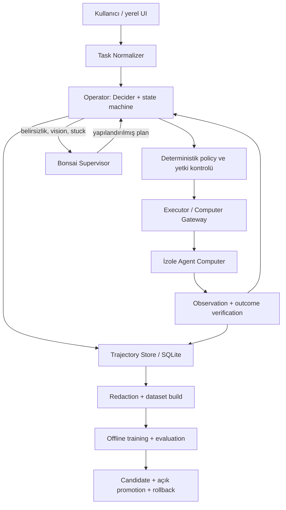

# Historical README and development observations — 2026-10-03

Preserved dated records, not current acceptance. Cumulative counters overlap; do not add them. See [current README](../README.md) and [delivery guide](DELIVERY_AND_CONTINUATION.md).

## Superseded goal snapshot — 3 October 2026, 14:22:59 UTC

Authoritative `get_goal`, scope `aos-goal-20261001-062218Z`, goal `bu son planı uygula`,
start `createdAt=1790835738` (1 October 2026, 06:22:18 UTC):
`tokensUsed=13180021`, `timeUsedSeconds=76787`, **21h 19m 47s / 21.3297222 hours**.
Observed development roles: Astra 6/high orchestration/review; Sol 6.1/high
implementation/validation; Sol 6.1/medium records/docs. Root model variant
unverified. This is a scoped cumulative observation, not a project total, billed
cost, human work time or model-specific usage; do not add overlapping counters.

## Superseded goal snapshot — 3 October 2026, 13:55:27 UTC

Authoritative `get_goal`, scope `aos-goal-20261001-062218Z`, goal `bu son planı uygula`,
start `createdAt=1790835738` (1 October 2026, 06:22:18 UTC):
`tokensUsed=12831282`, `timeUsedSeconds=75135`, **20h 52m 15s / 20.8708333 hours**.
Observed development roles: Astra 6/high orchestration/review; Sol 6.1/high
implementation/validation; Sol 6.1/medium records/docs. Root model variant
unverified. This scoped cumulative counter is not a whole-project total, billed
cost or human work time; do not add it to later snapshots or session counters.

# AOS — Agent Operating System

**Proje adı:** `aos-aserdargun-com` · **Paket:** mimari ve geliştirme başlangıcı v0.1 · **Tarih:** 19 Eylül 2026

**Uygulama kaynak deposu:** [aserdargun/aos](https://github.com/aserdargun/aos). `aserdargun/aos-aserdargun-com` ayrı tanıtım sitesi deposudur; çalışan uygulama kaynakları onun üzerine yazılmaz. Public kaynak paylaşımı, henüz seçilmemiş açık kaynak lisansı veya tamamlanmış ürün kabulü anlamına gelmez.

Tamamen yerel çıkarım hedefleyen, kendi izole Linux masaüstüne sahip iki mantıksal ajanlı bilgisayar kullanım ve öğrenme platformu. **Supervisor düşünür ve planlar; Operator sonlu seçeneklerden karar verir; deterministik Executor işlemi uygular ve sonucu doğrular.**

Bu README mimari sözleşmenin girişidir. Ayrıntılar bağlantılı `docs/` dosyalarındadır. Çalışan dilimler: `agentctl`, typed Operator, güvenli gateway, SQLite trajectory, gerçek yerel Decider/Bonsai recovery, DOM/vision kabulü ve Docker XFCE/noVNC Agent Computer. Authenticated FastAPI/React konsolu masaüstü kontrolü, salt okunur trace/registry ve kaynak limitlerini gösterir; Tauri native kabuğunun ilk build/startup smoke'u vardır. Genel görev API'si, tamamlanmış UI ve eğitim hâlâ geliştirme kapsamındadır. Model ağırlıkları ve yerel trajectory dosyaları kaynak paketine dahil değildir. Başlangıç kaynak sınırları [SOURCE_NOTES](../docs/SOURCE_NOTES.md), güncel kanıtlar [STATUS](../docs/STATUS.md) içindedir.

## Kontrol paneli

Çalışan yerel arayüz: **http://127.0.0.1:8765/ui/**. Varsayılan Development ekranında
**Genel durum**, **Sürüm kontrol listesi** ve **Kanıt geçmişi** ayrıdır. Canlı oturum
verisiyle tarihli geliştirme kaydı karıştırılmaz; eski gözlem başarı veya boşta
durumu sayılmaz. [Ekranı okuma ve Mac tüneli](../docs/CONTROL_CENTER.md).

## Geliştirme süresi, token kullanımı ve modeller

**3 Ekim 2026, 11:32:12 UTC / 14:32:12 Europe/Istanbul — shared-only kaynak adayı:** authoritative `get_goal`, scope `aos-goal-20261001-062218Z`, active hedef `bu son planı uygula`, başlangıç `createdAt = 1790835738` (1 Ekim 2026, 06:22:18 UTC). Ham kümülatif sayaçlar `tokensUsed = 10848317`, `timeUsedSeconds = 66540`: **18 saat 29 dakika; yaklaşık 18,4833333 saat**. Aynı goal kapsamıdır; tarihsel snapshot veya diğer oturumlarla toplanmaz. Gözlenen geliştirme rolleri: **Astra 6/high** orkestrasyon/inceleme, **Sol 6.1/high** kaynak adayı/CPU uygulaması, **Sol 6.1/medium** bağımsız envanter/belge. Root varyantı doğrulanmadı; AOS runtime modelleri ayrıdır. Sayaç model başına kullanım, input/output/cache, maliyet, insan saati veya bütün proje toplamı değildir. 41 dosya/86 giriş politikası taşıyan uygulanmamış shared-only adayının 6 CPU kontrolü geçti; canlı kaynaklar ve oturum değişmedi. [Aday](../scripts/shared-only-runtime-v1/README.md), [kanıt ve kalanlar](../docs/STATUS.md).

**3 Ekim 2026, 11:01:01 UTC / 14:01:01 Europe/Istanbul — staged Decider giriş bağlantısı:** authoritative `get_goal`, scope `aos-goal-20261001-062218Z`, active hedef `bu son planı uygula`, `createdAt = 1790835738` (1 Ekim 2026, 06:22:18 UTC): ham `tokensUsed = 10491018`, `timeUsedSeconds = 64670` (**17 saat 57 dakika 50 saniye; yaklaşık 17,9638889 saat**). Kapsam aynı goal'ın kümülatif sayacıdır; önceki snapshot veya başka oturumlarla toplanmaz. Gözlenen geliştirme rolleri **Astra 6/high** orkestrasyon/inceleme, **Sol 6.1/high** exec giriş ve uyumluluk uygulaması, **Sol 6.1/medium** belgedir. Root varyantı doğrulanmadı; runtime Decider/Bonsai/Scientist modelleri ayrıdır. Sayaç model başına tüketim, input/output/cache, maliyet, insan saati veya tüm proje toplamı değildir.7 yeni entry kontrolü normal filesystem, Btrfs ve ayrı sentetik Python3.12.13 venv'de geçti;17 inhibit kontrolü ayrıca geçti. Tekrarlı cohort'lar toplanmaz. Gerçek model worker/venv pinleri korunur; canlı config/store, legacy promotion veya GPU devri yapılmadı. [Yeni giriş](../docs/NATIVE_DECIDER_ENTRY.md), [kanıt](../docs/STATUS.md).

**3 Ekim 2026, 10:40:28 UTC / 13:40:28 Europe/Istanbul — native inhibit kaynak dilimi:** authoritative `get_goal`, scope `aos-goal-20261001-062218Z`, active hedef `bu son planı uygula`, `createdAt = 1790835738` (1 Ekim 2026, 06:22:18 UTC): ham `tokensUsed = 10317110`, `timeUsedSeconds = 63436` (**17 saat 37 dakika 16 saniye; yaklaşık 17,6211111 saat**). Aynı goal'ın kümülatif sayacıdır; önceki snapshot, alt ajan veya Scientist oturumuyla toplanmaz. Gözlenen geliştirme rolleri **Astra 6/high** orkestrasyon/inceleme, **Sol 6.1/high** inhibit uygulaması, **Sol 6.1/medium** belgedir. Root varyantı doğrulanmadı; runtime Decider/Bonsai/Scientist modelleri ayrıdır. Sayaç model başına tüketim, input/output/cache, maliyet, insan saati veya tüm proje toplamı değildir.14 odaklı CPU kontrolü normal filesystem ve gerçek Btrfs üzerinde geçti; aynı testlerin tekrarı iki ayrı özellik kabulü olarak toplanmaz. Native inhibit kaynakta bağımsız bir primitive'dir; canlı native girişlere bağlanmadı, GPU devri veya release uygulanmadı. [Sözleşme](../docs/NATIVE_INHIBIT.md), [kanıt](../docs/STATUS.md).

**3 Ekim 2026, 10:20:12 UTC / 13:20:12 Europe/Istanbul — native devir önizlemesi:** authoritative `get_goal`, scope `aos-goal-20261001-062218Z`, active hedef `bu son planı uygula`, `createdAt = 1790835738` (1 Ekim 2026, 06:22:18 UTC): ham `tokensUsed = 10152761`, `timeUsedSeconds = 62197` (**17 saat 16 dakika 37 saniye; yaklaşık 17,2769444 saat**). Kapsam aynı goal'ın kümülatif sayacıdır; önceki snapshot veya başka oturumlarla toplanmaz. Gözlenen geliştirme rolleri **Astra 6/high** orkestrasyon/inceleme, **Sol 6.1/high** önizleme uygulaması, **Sol 6.1/medium** dokümantasyondur. Root varyantı doğrulanmadı; runtime Decider/Bonsai/Scientist modelleri ayrıdır. Sayaç model başına tüketim, input/output/cache, maliyet, insan saati veya tüm proje toplamı değildir.12 odaklı CPU kontrolü ve gerçek salt okunur default oturum önizlemesi geçti; çalışan oturum değiştirilmedi. Native inhibit, ayrı bakım yetkisi ve gerçek GPU devri henüz tamamlanmadı. [Önizleme](../docs/NATIVE_HANDOVER.md), [kanıt](../docs/STATUS.md).

**3 Ekim 2026, 09:59:34 UTC / 12:59:34 Europe/Istanbul — ortak drain/seal kaynak teslimi:** authoritative `get_goal`, scope `aos-goal-20261001-062218Z`, active hedef `bu son planı uygula`, `createdAt = 1790835738` (1 Ekim 2026, 06:22:18 UTC): ham `tokensUsed = 9798914`, `timeUsedSeconds = 60983` (**16 saat 56 dakika 23 saniye; yaklaşık 16,9397222 saat**). Aynı goal'ın kümülatif sayacıdır; geçmiş snapshot veya başka oturumlarla toplanmaz. Gözlenen geliştirme rolleri: **Astra 6/high** orkestrasyon/inceleme, **Sol 6.1/high** scheduler/Lab sınırları, **Sol 6.1/medium** doküman ve manuel checkpoint. Root varyantı doğrulanmadı; AOS runtime Decider/Bonsai/Scientist modelleri ayrıdır. Sayaç model başına tüketim, input/output/cache, maliyet, insan saati veya tüm proje toplamı değildir. Ortak drain/seal ve process-bağlı kalıcı makbuz kaynakta tamamlandı;40 odaklı CPU/ASGI kontrolü geçti. Canlı servise uygulanmadı; native dışlama ve fiziksel GPU kabulü açık. [Sözleşme](../docs/SHARED_ADMISSION_DRAIN.md), [kanıt](../docs/STATUS.md).

**3 Ekim 2026, 09:29:15 UTC / 12:29:15 Europe/Istanbul — gerçek inert workspace teslimi:** authoritative `get_goal`, scope `aos-goal-20261001-062218Z`, active hedef `bu son planı uygula`, `createdAt = 1790835738` (1 Ekim 2026, 06:22:18 UTC): ham `tokensUsed = 9350182`, `timeUsedSeconds = 59163` (**16 saat 26 dakika 3 saniye; yaklaşık 16,4341667 saat**). Aynı goal'ın kümülatif sayacıdır; önceki snapshot, alt ajan veya Scientist sayaçlarıyla toplanmaz. Gözlenen geliştirme rolleri: **Astra 6/high** orkestrasyon/inceleme, **Sol 6.1/high** CLI/runtime ve inode hazırlığı, **Sol 6.1/medium** manuel ilerleme checkpoint'i. Root varyantı doğrulanmadı. Bunlar AOS runtime Decider/Bonsai/Scientist modellerinden ayrıdır. Sayaç model başına tüketim, input/output/cache, maliyet, insan saati veya tüm proje toplamı değildir. Gerçek public komutla ayrı workspace oluşturuldu; AOS ve Scientist bağımsız kaynak/plan/provision okumaları geçti. Servis/activation/GPU kabulü açık kalır. [Teslim ve sınırlar](../docs/STATUS.md).

**3 Ekim 2026, 09:09:50 UTC / 12:09:50 Europe/Istanbul — adaptif çalışma ve Btrfs doğrulaması:** authoritative `get_goal`, scope `aos-goal-20261001-062218Z`, active hedef `bu son planı uygula`, `createdAt = 1790835738` (1 Ekim 2026, 06:22:18 UTC): ham `tokensUsed = 8956795`, `timeUsedSeconds = 57980` (**16 saat 6 dakika 20 saniye; yaklaşık 16,1055556 saat**). Aynı goal'ın kümülatif sayacı; önceki snapshot veya başka oturumlarla toplanmaz. Gözlenen geliştirme rolleri Astra 6/high orkestrasyon ve Sol 6.1/high güvenlik/runtime uygulamasıdır; rutin işler için Sol 6.1/medium seçimi kullanıcı tercihidir, bu tur yeni medium işçi çalıştırılmadı. Root varyantı doğrulanmadı. AOS runtime Decider/Bonsai/Scientist modelleri ayrıdır. Sayaç model başına tüketim, input/output/cache, maliyet, insan saati veya tüm proje toplamı değildir. Btrfs üzerinde98 CPU kontrolü geçti;156 kaynak pini ve Scientist launcher diskten doğrulandı. Ortak activation/GPU kabulü tamamlanmadı. [Kanıt](../docs/STATUS.md).

**3 Ekim 2026, 08:42:38 UTC / 11:42:38 Europe/Istanbul — shared yazma kapsamı:** authoritative `get_goal`, scope `aos-goal-20261001-062218Z`, active hedef `bu son planı uygula`, `createdAt = 1790835738` (1 Ekim 2026, 06:22:18 UTC): ham `tokensUsed = 8786860`, `timeUsedSeconds = 56367` (**15 saat 39 dakika 27 saniye;15,6575 saat**). Aynı goal'ın kümülatif sayacıdır; diğer snapshot/oturumlarla toplanmaz. Gözlenen roller değişmedi: **Astra6/high** orkestrasyon/inceleme, iki **Sol6.1/high** runtime ve filesystem uygulama işçisi; root varyantı doğrulanmadı. Runtime Decider/Bonsai/Scientist modelleri ayrıdır. Sayaç tüm proje, model-bazlı tüketim, input/output/cache, insan saati veya faturalama değildir.19 scoped yol ve nested seed yazımı uygulandı;191 CPU testte185 PASS/6 SKIP. Ayrı named arayüz offline hazırlandı, servis açılmadı; gerçek ortak activation/GPU kabulü hâlâ açık. [Kanıt ve kalanlar](../docs/STATUS.md).

**3 Ekim 2026, 08:21:16 UTC / 11:21:16 Europe/Istanbul — adaptif orkestrasyon ve explicit provisioning:** authoritative `get_goal`, scope `aos-goal-20261001-062218Z`, active hedef `bu son planı uygula`, `createdAt = 1790835738` (1 Ekim 2026, 06:22:18 UTC): ham `tokensUsed = 8465387`, `timeUsedSeconds = 55085` (**15 saat 18 dakika 5 saniye; yaklaşık 15,3013889 saat**). Kapsam aynı goal'ın kümülatif sayacıdır; önceki veya alt ajan sayaçlarıyla toplanmaz. Gözlenen geliştirme rolleri: `/root/astra_high_ui_orchestration` **GPT-6 Astra / high** orkestrasyon ve bağımsız kaynak incelemesi; `/root/sol_high_completion_plan` ve `/root/sol_high_source_config_review` **GPT-6.1 Sol / high** kimlik, provisioning ve yaşam döngüsü uygulaması. Kullanıcının adaptif tercihi: rutin işlerde Sol6.1/medium, karmaşık güvenlik/runtime işlerinde high; yeni medium ajan açma denemesi thread sınırı nedeniyle gerçekleşmedi. Önceki Sol6.1/medium UI rolü tarihseldir; root varyantı doğrulanmadı. Bu roller AOS runtime Decider/Bonsai/Scientist modellerinden ayrıdır. Sayaç model başına tüketim, input/output/cache, faturalama, insan saati veya tüm proje toplamı değildir. Yeni dilimde72 shared CPU kontrolü ve87 legacy manager kontrolü toplam159 testte154 PASS/5 SKIP verdi; gerçek ortak runtime/GPU kabulü değildir. [Kalan izolasyon ve activation sınırları](../docs/SHARED_DESKTOP_MANAGER.md), [kanıt](../docs/STATUS.md).

**3 Ekim 2026, 07:57:11 UTC / 10:57:11 Europe/Istanbul — kontrol paneli teslimi ve adaptif model rolleri:** authoritative `get_goal`, scope `aos-goal-20261001-062218Z`, active hedef `bu son planı uygula`, `createdAt = 1790835738` (1 Ekim 2026, 06:22:18 UTC): ham `tokensUsed = 8122141`, `timeUsedSeconds = 53640` (**14 saat 54 dakika; 14,9 saat**). Kapsam aynı goal'ın kümülatif sayacıdır; önceki snapshot'lar veya Scientist/alt ajan sayaçlarıyla toplanmaz. Yeni gözlenen roller: `/root/astra_high_ui_orchestration` **GPT-6 Astra / high** kapanış incelemesi; `/root/sol_medium_panel_delivery` **GPT-6.1 Sol / medium** UI düzeni ve gerçek yerel tarayıcı doğrulaması. Önceki **Astra/max** tasarım ve **Sol6.1/high** runtime/şema rolleri tarihsel olarak korunur; root'un kesin varyantı doğrulanmadı. Bunlar AOS runtime Decider/Bonsai/Scientist modellerinden ayrıdır. Sayaç bütün proje, model başına tüketim, input/output/cache, insan çalışma saati veya faturalama sağlamaz. Yeni panelde 19 odaklı CPU/rendered kontrol ve gerçek8765 arayüzünde 41 read-only EN/TR desktop/mobile kontrolü geçti; backend yeniden başlatılmadı. Ayrı shared-manager kaynak adayı43 CPU testini geçti; gerçek ortak GPU/activation kabulü değildir. [Panel](../docs/CONTROL_CENTER.md), [runtime sınırları](../docs/SHARED_DESKTOP_MANAGER.md), [tarihli kanıt](../docs/STATUS.md).

**3 Ekim 2026, 07:07:03 UTC / 10:07:03 Europe/Istanbul — kalıcı görev orkestrasyonu devri:** authoritative `get_goal`, scope `aos-goal-20261001-062218Z`, active hedef `bu son planı uygula`, `createdAt = 1790835738` (1 Ekim 2026, 06:22:18 UTC): ham `tokensUsed = 7201729`, `timeUsedSeconds = 50640` (**14 saat 4 dakika; yaklaşık 14,0666667 saat**). Bu aynı goal'ın kümülatif gözlemidir; önceki snapshot'lar, alt ajanlar veya Scientist'in ayrı sayacıyla toplanmaz. Gözlenen geliştirme rolleri: **GPT-6 Astra / max** orkestrasyon tasarımı ve GPU giriş yollarının salt okunur incelemesi; **GPT-6.1 Sol / high** kalıcı çekirdek, Scientist adaptörü ve kaynak/config incelemesi; root'un kesin model varyantı doğrulanmadı. Bunlar runtime Decider/Bonsai/Scientist modellerinden ayrıdır. Sayaç tüm proje toplamı, model başına tüketim, input/output/cache, insan çalışma saati veya fatura maliyeti vermez. Yeni opt-in runner ve adaptörlerinde 49 CPU/sentetik test geçti; dört gerçek sabit CPU alt süreciyle bağımlılık, kota, iptal ve yeniden oynatmama doğrulandı. Gerçek model/GPU veya kullanıcı UI'sine orkestrasyon teslimi değildir. [Kapsam ve komut](../docs/AGENT_ORCHESTRATION.md). Yeni ortak config ACK kabul edildi; broker dışından GPU kullanabilen mevcut native UI nedeniyle gerçek ortak GPU koşusu hâlâ bekler.

**3 Ekim 2026, 06:18:45 UTC / 09:18:45 Europe/Istanbul — kontrol merkezi ve gerçek yerel UI devri gözlemi:** ana oturumun authoritative `get_goal` gözlemi, scope `aos-goal-20261001-062218Z`, active hedef `bu son planı uygula`, `createdAt = 1790835738` (1 Ekim 2026, 06:22:18 UTC): ham `tokensUsed = 6208999`, `timeUsedSeconds = 47742` (**13 saat 15 dakika 42 saniye; yaklaşık 13,2616667 saat**). Kapsam aynı goal'ın kümülatif sayacıdır; tarihsel gözlemlerle veya Scientist oturumunun ayrı sayacıyla toplanmaz. Gözlenen geliştirme rolleri: `/root/astra_max_completion_plan` **GPT-6 Astra / max** plan ve bağımlılık pini incelemesi; **GPT-6.1 Sol / high** UI, kaynak/config, fenced recovery ve belge uygulaması. Root varyantı doğrulanmadı. Bu geliştirme rolleri AOS runtime Decider/Bonsai ve Scientist deney modellerinden ayrıdır; sayaç faturalama, input/output/cache, model başına tüketim, insan çalışma saati veya bütün proje toplamı sağlamaz. Yeni kontrol merkezi birleşik CPU build'i ve gerçek yerel8765 UI/giriş/read-only kontrolü geçti; yeni görev, native çıkarım, ortak GPU, gerçek Mac/SSH veya ürün tamamlanması kabulü değildir. İmzalı paket kökeniyle yeniden pinlenen sekiz Bonsai native bağımlılığı yeni deployment kimliği oluşturdu; önceki ortak source/config ACK tarihsel kaldı, Scientist'in aynı-wire config türetimi ayrıca beklenir.

**2 Ekim 2026, 06:40:22 UTC / 09:40:22 Europe/Istanbul — yeni ortak paket bekleme denetimi:** authoritative `get_goal`, scope `aos-goal-20261001-062218Z`, gözlemde active hedef `bu son planı uygula`, `createdAt = 1790835738` (1 Ekim 2026, 06:22:18 UTC): ham `tokensUsed = 4743503`, `timeUsedSeconds = 43891` (**12 saat 11 dakika 31 saniye; yaklaşık 12,1919444 saat**). Doğrulanmış geliştirme rolü: `/root/astra_max_orchestration` **GPT-6 Astra / max**, salt okunur kapanış/orkestrasyon ajanı; root mevcut servis, kaynak ve devir kayıtlarını denetledi, kesin root varyantı doğrulanmadı. Bu gözlem yeni uygulama veya native kabul başarısı değildir. Kümülatif goal sayacı önceki snapshot'lara eklenmez; model başına tüketim, input/output/cache, faturalama, insan saati veya bütün proje toplamı değildir. Runtime Decider/Bonsai/Scientist modelleri ve Scientist oturumunun ayrı sayacı bu geliştirme sayacından ayrıdır.

**2 Ekim 2026, 04:54:45 UTC / 07:54:45 Europe/Istanbul — yeniden active goal gözlemi:** authoritative `get_goal`, scope `aos-goal-20261001-062218Z`, hedef `bu son planı uygula`, `createdAt = 1790835738` (1 Ekim 2026, 06:22:18 UTC): ham `tokensUsed = 3521112`, `timeUsedSeconds = 37602` (**10 saat 26 dakika 42 saniye; 10,445 saat**). Kapsam bu goal'ın kümülatif sayacıdır; önceki snapshot'larla toplanmaz. Donmuş dönemlerin ayrı tüketimi bu gözlemden çıkarılamaz. Root AOS kaynak eşliği/teslim koordinasyonu yürütür; kullanıcı Astra 6 / extra-high istemiştir fakat root backend/model değişimi gözlenmiş değildir. Yeni alt ajan açılmadı. Geliştirme rolleri runtime Decider/Bonsai/Scientist modellerinden ayrıdır; bütün proje tüketimi, model bazlı kullanım, insan saati veya fatura maliyeti iddia edilmez.

**2 Ekim 2026, 03:15:54 UTC / 06:15:54 Europe/Istanbul — native ortak koşu/owner-loop request fencing gözlemi:** authoritative `get_goal`, scope `aos-goal-20261001-062218Z`, `createdAt = 1790835738`, hâlâ blocked/frozen: ham `tokensUsed = 3387845`, `timeUsedSeconds = 37253` (**10 saat 20 dakika 53 saniye; 10,3480556 saat**). Bu ayrı koordinasyon/HTTP ve owner-loop hook geliştirmesi tüketimi unavailable; tarihsel sayaçlar toplanmaz ve bütün proje/maliyet/model bazlı kullanım sayılmaz. Yeni root model kimliği veya alt ajan gözlenmedi. Geliştirme rolleri runtime Decider/Bonsai ve Scientist local-Qwen modellerinden ayrıdır. Gerçek dosya→sınırlı sentetik deney→AOS rapor/readback doğrulandı; tekrar çağrı/reconciliation/fairness/iptal kabulü henüz tamamlanmadı.

**Sayaç erişim sınırı — 2 Ekim 2026, 01:11:01 Europe/Istanbul (1 Ekim 22:11:01 UTC):** ayrı Scientist V4 handoff/metadata-format düzeltmesi sırasında `get_goal` blocked hedefin donmuş `tokensUsed = 3387845`, `timeUsedSeconds = 37253` (**10 saat 20 dakika 53 saniye; yaklaşık 10,3481 saat**) değerlerini döndürdü; kapsam/start aynı thread ve `createdAt = 1790835738` hedefidir. Bu sonraki işin ayrı tüketimi unavailable; aşağıdaki son active snapshot **historical** tutulur, overlapping sayaç eklenmez. Yeni alt ajan veya doğrulanmış root model kimliği gözlenmedi; root bounded AOS runtime işleri Scientist source'dan ayrıdır. Bu değerler bütün proje/model-bazlı tüketim, insan saati veya maliyet değildir.

**22:18 UTC takip notu:** aynı ayrı handoff içindeki kapsamlı CPUmetadata/source/readonlyDB preflight tamamlandı; hedef sayaç kapsamı tekrar active olmadı. Bu iş için yeni token/saat tahmini eklenmez; yukarıdaki frozen ve aşağıdaki active snapshot'lar historical/unavailable sınırlarıyla korunur. Yeni geliştirme-model kimliği veya alt ajan gözlenmedi.

**22:26 UTC takip notu:** ayrı Scientist V5 handoff ile gerçek retainedclosure/SQLreadback ve sourceDevelopment kaydı güncellendi; authoritative goal hâlâ blocked/frozen, bu işin ayrı token/süre sayacı unavailable. Historical sayılar korunur/toplanmaz; yeni alt ajan veya doğrulanmış root model kimliği yok. Bu başarı runtimeGPU/ürün tamamlanması değildir.

**Son gerçek retained-recovery koordinasyon sayacı — 2 Ekim 2026, 00:54:23 Europe/Istanbul (1 Ekim 21:54:23 UTC):** authoritative `get_goal`, scope `aos-goal-20261001-062218Z`, hedef `bu son planı uygula`, gözlemde active, `createdAt = 1790835738` (1 Ekim 2026, 06:22:18 UTC): ham `tokensUsed = 3382152`, `timeUsedSeconds = 37186` (**10 saat 19 dakika 46 saniye; yaklaşık 10,3294 saat**). Bu snapshot blocked audit/status güncellemesinden öncedir. Root aynı dış review/finite-plan kapısını üçüncü ardışık goal turn'de tekrar doğruladı; yeni uygulama/runtime ilerlemesi iddia edilmez. Yeni alt ajan veya doğrulanmış root model kimliği yok. Geliştirme rolleri AOS runtime Decider/Bonsai modellerinden ayrıdır. Önceki aynı-hedef sayaçlar tarihsel olup toplanmaz; bütün proje, model bazlı kullanım, insan çalışma saati veya maliyet değildir.

**Son gerçek runtime-config review sayacı — 1 Ekim 2026, 22:25:31 Europe/Istanbul (19:25:31 UTC):** authoritative `get_goal`, scope `aos-goal-20261001-062218Z`, active hedef `bu son planı uygula`, `createdAt = 1790835738` (1 Ekim 2026, 06:22:18 UTC): ham `tokensUsed = 2451695`, `timeUsedSeconds = 28070` (**7 saat 47 dakika 50 saniye; yaklaşık 7,7972 saat**). Root actual75 source/historical/SQL/privateconfig salt okunur incelemesi, boundedconsumer candidate ve migration CPU regresyonu/Scientist koordinasyonunu yürüttü; yeni alt ajan veya doğrulanmış root model kimliği yok. Geliştirme rolleri AOS runtime Decider/Bonsai modellerinden ayrıdır. Aynı-hedef tarihsel sayaçlar toplanmaz; bütün proje, model bazlı kullanım, insan çalışma saati veya maliyet çıkarımı değildir.

**Son gerçek producer-format incelemesi sayacı — 1 Ekim 2026, 21:58:04 Europe/Istanbul (18:58:04 UTC):** authoritative `get_goal`, scope `aos-goal-20261001-062218Z`, active hedef `bu son planı uygula`, `createdAt = 1790835738` (1 Ekim 2026, 06:22:18 UTC): ham `tokensUsed = 2367124`, `timeUsedSeconds = 26640` (**7 saat 24 dakika; 7,4 saat**). Root Scientist canonical formatını salt okunur inceledi, AOS eşleştirmesini RED/GREEN ile düzeltti ve koordinasyonu yürüttü; yeni alt ajan veya doğrulanmış root model kimliği yok. Geliştirme rolleri AOS runtime Decider/Bonsai modellerinden ayrıdır. Aynı-hedef tarihsel sayaçlar toplanmaz; bütün proje, model bazlı kullanım, insan çalışma saati veya maliyet çıkarımı değildir.

**Son dört-helper source freeze sayacı — 1 Ekim 2026, 21:52:45 Europe/Istanbul (18:52:45 UTC):** authoritative `get_goal`, scope `aos-goal-20261001-062218Z`, active hedef `bu son planı uygula`, `createdAt = 1790835738` (1 Ekim 2026, 06:22:18 UTC): ham `tokensUsed = 2342463`, `timeUsedSeconds = 26320` (**7 saat 18 dakika 40 saniye; yaklaşık 7,3111 saat**). Root canonical/observer kodu ve CPU doğrulaması, Scientist kaynaklarının salt okunur incelemesi ve koordinasyonunu yürüttü; yeni alt ajan veya doğrulanmış root model kimliği yok. Geliştirme rolleri AOS runtime Decider/Bonsai modellerinden ayrıdır. Aynı-hedef tarihsel sayaçlar toplanmaz; bütün proje, model bazlı kullanım, insan çalışma saati veya maliyet çıkarımı değildir.

**Son cleanup-authority doğrulama sayacı — 1 Ekim 2026, 21:40:28 Europe/Istanbul (18:40:28 UTC):** authoritative `get_goal`, scope `aos-goal-20261001-062218Z`, active hedef `bu son planı uygula`, `createdAt = 1790835738` (1 Ekim 2026, 06:22:18 UTC): ham `tokensUsed = 2230016`, `timeUsedSeconds = 25584` (**7 saat 6 dakika 24 saniye; yaklaşık 7,1067 saat**). Root AOS recovery kodu/CPU doğrulaması, gerçek private artifact/own DB salt okunur incelemesi ve Scientist koordinasyonunu yürüttü; yeni alt ajan veya doğrulanmış root model kimliği yok. Geliştirme rolleri AOS runtime Decider/Bonsai modellerinden ayrıdır. Aynı-hedef tarihsel sayaçlar toplanmaz; bütün proje, model bazlı kullanım, insan çalışma saati veya maliyet çıkarımı değildir.

**Son fiziksel observer geliştirme sayacı — 1 Ekim 2026, 21:30:13 Europe/Istanbul (18:30:13 UTC):** authoritative `get_goal`, scope `aos-goal-20261001-062218Z`, active hedef `bu son planı uygula`, `createdAt = 1790835738` (1 Ekim 2026, 06:22:18 UTC): ham `tokensUsed = 2178333`, `timeUsedSeconds = 24968` (**6 saat 56 dakika 8 saniye; yaklaşık 6,9356 saat**). Root AOS observer kodu/CPU doğrulaması ve Scientist koordinasyonunu yürüttü; yeni alt ajan veya doğrulanmış root model kimliği yok. Geliştirme rolleri AOS runtime Decider/Bonsai modellerinden ayrıdır. Aynı-hedef tarihsel sayaçlar toplanmaz; bütün proje, model bazlı kullanım, insan çalışma saati veya maliyet çıkarımı değildir.

**Son doğrudan oturum koordinasyonu sayacı — 1 Ekim 2026, 21:24:30 Europe/Istanbul (18:24:30 UTC):** authoritative `get_goal`, scope `aos-goal-20261001-062218Z`, active hedef `bu son planı uygula`, `createdAt = 1790835738` (1 Ekim 2026, 06:22:18 UTC): ham `tokensUsed = 2137522`, `timeUsedSeconds = 24619` (**6 saat 50 dakika 19 saniye; yaklaşık 6,8386 saat**). Root doğrudan Scientist haberleşmesi ve AOS devir kaydını yürüttü; yeni alt ajan veya doğrulanmış root model kimliği yok. Geliştirme rolleri AOS runtime Decider/Bonsai modellerinden ayrıdır. Aynı-hedef tarihsel sayaçlar toplanmaz; bu gözlem bütün proje, model bazlı kullanım, insan çalışma saati veya maliyet değildir.

**Son observational consumer teslim sayacı — 1 Ekim 2026, 21:12:58 Europe/Istanbul (18:12:58 UTC):** authoritative `get_goal`, scope `aos-goal-20261001-062218Z`, active hedef `bu son planı uygula`, `createdAt = 1790835738` (1 Ekim 2026, 06:22:18 UTC): ham `tokensUsed = 2094487`, `timeUsedSeconds = 23859` (**6 saat 37 dakika 39 saniye; yaklaşık 6,6275 saat**). Root AOS consumer/migration/CPU doğrulama/Scientist koordinasyonu gözlendi; yeni alt ajan veya doğrulanmış root model kimliği yok. Tarihsel geliştirme-model rolleri runtime modellerinden ayrıdır. Aynı-hedef sayaçlar toplanmaz; bütün proje, model bazlı kullanım veya maliyet değildir.

**Son no-admission sözleşme incelemesi sayacı — 1 Ekim 2026, 20:30:17 Europe/Istanbul (17:30:17 UTC):** authoritative `get_goal`, scope `aos-goal-20261001-062218Z`, active hedef `bu son planı uygula`, `createdAt = 1790835738` (1 Ekim 2026, 06:22:18 UTC): ham `tokensUsed = 1818482`, `timeUsedSeconds = 21345` (**5 saat 55 dakika 45 saniye; yaklaşık 5,9292 saat**). Root AOS inceleme/sözleşme/Scientist koordinasyonu gözlendi; yeni alt ajan veya doğrulanmış root model kimliği yok. Tarihsel geliştirme-model rolleri runtime Decider/Bonsai modellerinden ayrıdır. Aynı-hedef sayaçlar toplanmaz; bütün proje, model bazlı kullanım veya maliyet değildir.

**Son infer bağlantı düzeltmesi sayacı — 1 Ekim 2026, 20:23:08 Europe/Istanbul (17:23:08 UTC):** authoritative `get_goal`, aynı thread/hedef, `createdAt = 1790835738` başlangıcı: ham `tokensUsed = 1786608`, `timeUsedSeconds = 20928` (**5 saat 48 dakika 48 saniye; yaklaşık 5,8133 saat**). Root AOS düzeltme/CPU test/Scientist koordinasyonu gözlendi; yeni alt ajan veya doğrulanmış root model kimliği yok. Tarihsel geliştirme-model rolleri runtime modellerinden ayrıdır. Aynı-hedef snapshot'ları toplanmaz; bütün proje, model bazlı kullanım veya maliyet çıkarımı değildir.

**Son phase-contract düzeltmesi sayacı — 1 Ekim 2026, 20:06:16 Europe/Istanbul (17:06:16 UTC):** authoritative `get_goal`, aynı thread/hedef ve `createdAt = 1790835738` kapsamı: ham `tokensUsed = 1722660`, `timeUsedSeconds = 19931` (**5 saat 32 dakika 11 saniye; yaklaşık 5,5364 saat**). Root AOS geliştirme/CPU doğrulama/Scientist koordinasyonu gözlendi; yeni alt ajan veya doğrulanmış root model kimliği yok. Tarihsel geliştirme rolleri runtime Decider/Bonsai modellerinden ayrıdır. Bu snapshot aşağıdaki aynı-hedef sayaçlara eklenmez; bütün proje/model bazlı kullanım veya maliyet değildir.

**Son gerçek S1 tanı readback sayacı — 1 Ekim 2026, 19:59:05 Europe/Istanbul (16:59:05 UTC):** authoritative `get_goal`, scope `aos-goal-20261001-062218Z`, active hedef `bu son planı uygula`: ham `tokensUsed = 1684877`, `timeUsedSeconds = 19492` (**5 saat 24 dakika 52 saniye; yaklaşık 5,4144 saat**). Kapsam başlangıcı `createdAt = 1790835738` (1 Ekim 2026, 06:22:18 UTC). Aynı-hedef tarihsel snapshot'ları toplanmaz; bu sayaç bütün proje, faturalama veya model bazlı kullanım değildir. AOS root geliştirme/tanı/koordinasyon rolü gözlendi; root model kimliği doğrulanmadı ve yeni alt ajan açılmadı. Tarihsel geliştirme-model rolleri aşağıdadır; AOS runtime Decider/Bonsai modellerinden ayrıdır.

**Son bounded evidence tanı sayacı — 1 Ekim 2026, 19:37:25 Europe/Istanbul (16:37:25 UTC):** `get_goal`, scope `aos-goal-20261001-062218Z`, active hedef `bu son planı uygula`: ham kümülatif `tokensUsed = 1568626`, `timeUsedSeconds = 18200` (**5 saat 3 dakika 20 saniye; yaklaşık 5,0556 saat**). Kapsam başlangıcı `createdAt = 1790835738` (**1 Ekim 2026, 06:22:18 UTC; 09:22:18 Europe/Istanbul**). Aşağıdaki aynı-hedef snapshot'ları tarihsel gözlemlerdir ve toplanmaz. Root AOS düzeltme/test/koordinasyon işini yürüttü; yeni AOS alt ajanı veya doğrulanmış root model kimliği yoktur. Tarihsel GPT-6 Astra/high geliştirme işçisi rolleri ayrı korunur; runtime Decider/Bonsai ve Scientist deney modelleri geliştirme modelleri olarak bu sayaçtan çıkarılamaz. Tüm proje toplamı, insan/GPU saati, billed cost veya girdi/çıktı/cache/model başına kullanım çıkarımı yapılmaz. Gerçek ortak model/GPU görev kabulü açık kalır.

**Son evidence staging düzeltmesi sayacı — 1 Ekim 2026, 19:19:36 Europe/Istanbul (16:19:36 UTC):** `get_goal`, scope `aos-goal-20261001-062218Z`, active hedef `bu son planı uygula`: ham kümülatif `tokensUsed = 1536758`, `timeUsedSeconds = 17131` (**4 saat 45 dakika 31 saniye; yaklaşık 4,7586 saat**). Kapsam başlangıcı `createdAt = 1790835738` (**1 Ekim 2026, 06:22:18 UTC; 09:22:18 Europe/Istanbul**). Aynı kapsamın önceki tarihsel gözlemleri 12:50:40 UTC için `1381217` token / `15157` saniye, 12:35:33 UTC için `1259163` token / `14237` saniyedir; bu sayaçlar toplanmaz. Root AOS kaynak düzeltmesi/test/koordinasyon işini yürüttü; yeni AOS alt ajanı veya doğrulanmış root model kimliği yoktur. Tarihsel GPT-6 Astra/high geliştirme işçisi rolleri ayrı korunur. AOS runtime Decider/Bonsai, Scientist deney modelleri ve geliştirme modelleri farklı rollerdir; bu sayaç model başına tüketim, tüm proje toplamı, insan/GPU saati, billed cost veya girdi/çıktı/cache dağılımı sağlamaz. Gerçek izole startup/cleanup ve ayrı CPU regresyon kanıtı vardır; ortak GPU görev kabulü henüz yoktur.

**Son koordinasyon ve bağımsız inceleme sayacı — 1 Ekim 2026, 15:16:34 Europe/Istanbul (12:16:34 UTC):** `get_goal`, scope `aos-goal-20261001-062218Z`, active hedef `bu son planı uygula`: ham kümülatif `tokensUsed = 1214608`, `timeUsedSeconds = 13078` (**3 saat 37 dakika 58 saniye; yaklaşık 3,6328 saat**). Kapsam başlangıcı `createdAt = 1790835738` (**1 Ekim 2026, 06:22:18 UTC; 09:22:18 Europe/Istanbul**). Aynı hedefin önceki snapshot'ları tarihsel gözlemdir ve toplanmaz. Root AOS inceleme/koordinasyon işini yürüttü; yeni AOS alt ajanı veya doğrulanmış root model kimliği yoktur. Tarihsel GPT-6 Astra/high geliştirme işçisi rolleri ayrı korunur; AOS runtime Decider/Bonsai ve Scientist deney modelleri geliştirme rolü veya model başına tüketim olarak bu sayaçtan çıkarılamaz. Sayaç tüm proje toplamı, insan/GPU saati, billed cost veya girdi/çıktı/cache dağılımı değildir. Gerçek ortak GPU kabulü henüz tamamlanmadı.

**Son kaynak düzeltmesi sayacı — 1 Ekim 2026, 14:15:04 Europe/Istanbul (11:15:04 UTC):** `get_goal`, scope `aos-goal-20261001-062218Z`, active hedef `bu son planı uygula`: ham kümülatif `tokensUsed = 972705`, `timeUsedSeconds = 9420` (**2 saat 37 dakika; yaklaşık 2,6167 saat**). Kapsam başlangıcı `createdAt = 1790835738` (**1 Ekim 2026, 06:22:18 UTC; 09:22:18 Europe/Istanbul**). Bu snapshot aynı hedefin aşağıdaki önceki gözlemlerinin yerine güncel referanstır; sayaçlar toplanmaz. Root AOS asset izolasyonu ve bağımsız authenticated API GET incelemesini yürüttü; yeni AOS alt ajanı veya doğrulanmış root model kimliği yoktur. Tarihsel GPT-6 Astra/high geliştirme işçisi rolleri ayrı korunur; AOS runtime Decider/Bonsai modelleri bu sayaçtan ayrıdır. Tüm proje toplamı, insan/GPU saati, billed cost ve girdi/çıktı/cache/model başına dağılım çıkarılamaz.

**Güncel hedef sayacı — 1 Ekim 2026, 13:18:57 Europe/Istanbul (10:18:57 UTC):** `get_goal`, scope `aos-goal-20261001-062218Z`, active hedef `bu son planı uygula`: ham kümülatif `tokensUsed = 695951`, `timeUsedSeconds = 6053` (**1 saat 40 dakika 53 saniye; yaklaşık 1,6814 saat**). Kapsam başlangıcı `createdAt = 1790835738` (**1 Ekim 2026, 06:22:18 UTC; 09:22:18 Europe/Istanbul**). Bu gözlem aşağıdaki aynı hedefin tarihsel snapshot'ının yerine güncel referanstır; sayılar toplanmaz. Son doğrudan Scientist koordinasyonu ve salt okunur launcher/config incelemesini root yürüttü; yeni alt ajan çalıştırılmadı, root model kimliği veya model başına kullanım doğrulanmadı. Önceden gözlenen GPT-6 Astra/high geliştirme işçisi rolleri aşağıda ayrı korunur; AOS Decider/Bonsai runtime modelleri geliştirme sayacından ayrıdır. Sayaç bütün proje toplamını, insan/GPU saatini, billed cost veya girdi/çıktı/cache dağılımını kanıtlamaz.

**Sonraki kullanıcı isteği için sayaç sınırı — 1 Ekim 2026, 12:42:32 Europe/Istanbul (09:42:32 UTC):** Doğrudan Scientist koordinasyonu ve source-deadline düzeltmesi sırasında `get_goal` aşağıdaki son blocked gözlemin aynı donmuş değerlerini döndürdü. Bu sonraki çalışmanın ayrı tüketimi ölçülemiyor; tarihsel snapshot korunur, token/süre eklenmez. Yeni alt ajan veya ayrı model kimliği gözlenmedi.

**Tarihsel sayaç erişim notu — 1 Ekim 2026, 11:12:26 Europe/Istanbul (08:12:26 UTC):** Opt-in workspace hazırlama isteği sırasında `get_goal` blocked hedefin donmuş değerlerini döndürdü; o aralıktaki ayrı tüketim ölçülemedi ve tahmin eklenmedi. Hedef tekrar active olduğunda erişilebilen yeni sayaç gözlemi aşağıda ayrı kaydedilir; kapsamlar veya varsayılan tüketimler toplanmaz.

**Son gözlem: 1 Ekim 2026, 12:30:53 (Europe/Istanbul; 09:30:53 UTC).** Kaynak: `get_goal`, scope `aos-goal-20261001-062218Z`. Hedef `bu son planı uygula`, `blocked`: `tokensUsed = 624509`, `timeUsedSeconds = 5510` (**1 saat 31 dakika 50 saniye; yaklaşık 1,5306 saat**), `createdAt = 1790835738` (**1 Ekim 2026, 09:22:18 Europe/Istanbul; 06:22:18 UTC**). Bu hedef sayacı aşağıdaki tarihsel hedef sayacından ayrı kapsamdadır; değerler toplanmaz. Gözlenen geliştirme rolleri retained **GPT-6 Astra/high** belge/UI ve test-fixture işçileri ile root kaynak düzeltmesi, denetim ve canlı UI doğrulamasıdır; son workspace ve deadline düzeltmesinde yeni alt ajan çalıştırılmadı. Root model kimliği ve model başına kullanım bu sayaçtan doğrulanamaz. AOS runtime modelleri ayrı katmandır; sayaç billed cost, girdi/çıktı/cache veya bütün proje toplamı değildir.

**Tarihsel önceki hedef gözlemi: 1 Ekim 2026, 06:38:51 (Europe/Istanbul; 03:38:51 UTC).** Aşağıdaki kümülatif değerler önceki `bu projeyi tamamlayana kadar devam et` hedefi kapsamında doğrulanmıştır ve artık güncel hedef sayacı değildir. Alt coding worker sayaçları toplanmaz. Sayılar tamamlanmış proje maliyeti değildir; hedefler dışındaki toplamı, billed cost veya girdi/çıktı/cache/model başına dağılımı kanıtlamaz.

| Ölçüm | Kaydedilen değer | Kapsam |
|---|---|---|
| Sayaçtaki süre | **80 saat 25 dakika 2 saniye** — yaklaşık **80,42 saat** | `timeUsedSeconds = 289502`; insan çalışma saati, GPU saati veya paralel ajan-saat toplamı olarak yorumlanmaz |
| Sayaçtaki token | **64.540.563 token** — yaklaşık **64,54 milyon** | `tokensUsed = 64540563`; sayaç girdi/çıktı/cache ve model başına dağılım vermiyor |
| Ölçülen hedefin başlangıcı | **23 Eylül 2026, 16:46:45 (Europe/Istanbul)** | `createdAt = 1790171205`; bu hedef öncesindeki geliştirme ve başka konuşmalar kapsanmış kabul edilmez |
| Projenin tüm geçmişi / parasal maliyet | **Tam toplam doğrulanamıyor** | Eksik oturum geçmişi ve faturalandırma dökümü nedeniyle sayı uydurulmaz |

Geliştirmede kullanılan/istenen modeller ile AOS'un çalıştırdığı modeller farklıdır. Aşağıdaki kayıt doğrulanabilen geçmişi ve açıkça işaretlenmiş tercihleri gösterir; bütün geçmiş çağrıların eksiksiz dökümü değildir:

| Katman | Model ve rol | Kanıt / sınır |
|---|---|---|
| 1 Ekim skill metadata recovery UI | Retained **GPT-6 Astra · high** — API/requests, EN/TR UI ve bağımsız inceleme; root — synthetic Chromium recovery/lost-ACK doğrulaması ve docs | 29 CPU/sentetik test,1 GPU-disabled Chromium testi ve TypeScript geçti. Native model/öğrenme/GPU/deploy veya ana backend/model-başına kullanım doğrulanmadı |
| 1 Ekim named Mac connector | Retained **GPT-6 Astra · high** — shell uygulaması ve bağımsız inceleme; root — console identity, supervisor readiness, gerçek CPU/HTTP/browser bileşimi ve docs | 85 CPU/mock PASS; gerçek CPU/HTTP ve GPU-disabled browser1 PASS/12,587s, SSH/Darwin/open sentetik. Gerçek Mac/tünel/native model/GPU/deploy kabulü veya model-başına kullanım doğrulanmadı |
| 1 Ekim public UI preparation | Retained **GPT-6 Astra · high** — offline named preparation ve counterpart source review; root — public CLI/browser acceptance ve docs | Gerçek CPU fixture ve GPU-disabled Chromium login/Development/EN-TR/mobile akışı1 PASS/12,562s. Canlı8765 deploy, native model, Scientist veya GPU kabulü değil; ana backend/model-başına kullanım doğrulanmadı |
| 1 Ekim named restart/recovery | Retained **GPT-6 Astra · high** — exact-session lifecycle/CAS uygulaması ve independent review; root — manager metadata, EN/TR scope guidance ve gerçek CPU restart kabulü | Son public CLI koşusu1 PASS/11,734s,3 CPU fixture oturumu. Reboot/crash/native model/Scientist/GPU kabulü değil; ana backend/model-başına kullanım doğrulanmadı |
| 1 Ekim public CPU project lifecycle | Retained **GPT-6 Astra · high** — public CLI fixture lifecycle/test ve independent staging review; root — private UI/preflight/console ve handoff | İki gerçek CPU fixture oturumu1 PASS/7,374s;177 regresyon176 PASS/1 SKIP. Gerçek model/Scientist/GPU/learning/deploy değil; ana backend/model-başına kullanım doğrulanmadı |
| 1 Ekim isolated learning project | Retained **GPT-6 Astra · high** — scoped manager/CPU testleri ve independent isolation review; root — backend/console metadata, cookies, EN/TR guides ve handoff | 160 CPU/mock test:159 PASS/1 SKIP; izole GPU-disabled UI ve TypeScript. Gerçek çok-projeli model/GPU/deploy değil; ana backend/model-başına kullanım doğrulanmadı |
| 1 Ekim explicit report history | Retained **GPT-6 Astra · high** — immutable backend/HTTP-SQL testleri ve independent audit; root — authenticated console, EN/TR UI, migration audit ve handoff | 128 CPU/sentetik kontrol, 7 izole GPU-disabled Chromium testi ve TypeScript; gerçek Scientist/GPU/deploy değil. Ana backend/model-başına kullanım doğrulanmadı |
| 1 Ekim Lab lifecycle fixes | Retained **GPT-6 Astra · high** — START readback/HTTP-SQL tests ve independent audit; root — REPORT baseline fix/protocol regresyon/handoff | 212 CPU/sentetik test ve son50 odaklı kontrol; gerçek Lab/GPU/deploy değil. Ana backend/model-başına sayaç doğrulanmadı |
| 1 Ekim current caller generation | Retained **GPT-6 Astra · high** — concrete caller observer/tests ve independent source review; root — regression/pair/handoff | 222 CPU/sentetik test; patched proc/systemctl ve identity-only proof. Canlı runtime/GPU/deploy veya ana backend/model-başına sayaç doğrulanmadı |
| 1 Ekim configured-source readback | Retained **GPT-6 Astra · high** — concrete source callback/test ve independent review; root — source profile, Development EN/TR UI ve regresyon/handoff | 208 CPU/sentetik test, izole GPU-disabled Chromium ve TypeScript; actual current runtime/dependency hakları/GPU/deploy değil. Ana backend/model-başına sayaç doğrulanmadı |
| 1 Ekim single typed factory startup | Retained **GPT-6 Astra · high** — actual startup wiring ve read-only counterpart incelemesi; root — frozen output pin/regresyon/handoff | 192 CPU/sentetik test; exact factory hooks ve no implicit execution, canlı yapılandırma/GPU/deploy değil. Ana backend/model-başına sayaç doğrulanmadı |
| 1 Ekim trusted bootstrap factory | Retained **GPT-6 Astra · high** — factory/CPU test uygulaması ve bağımsız inceleme; root — source profile/regresyon/handoff | 187 CPU/sentetik test; source composition ve durable audit, canlı source/config/GPU/deploy değil. Ana backend veya model-başına tüketim doğrulanmadı |
| 1 Ekim async bootstrap wiring | Retained **GPT-6 Astra · high** — async bridge/deadline uygulaması ve bağımsız inceleme; root — actual desktop/startup ve typed guard tests | 138 CPU/sentetik test; host-thread SQL/off-loop network, gerçek model/GPU/deploy değil. Main backend veya model-başına tüketim doğrulanmadı |
| 1 Ekim inherited retained provider | Retained **GPT-6 Astra · high** — AOS client/adapter ve bağımsız kaynak incelemesi; root — source profile/regresyon/handoff | 116 CPU/sentetik test; actual packet credentials ve original SQL, fakat Scientist/GPU/deploy kabulü değil. Model-başına sayaç veya ana backend değişimi kanıtlanmadı |
| 1 Ekim bootstrap capability reader | Retained **GPT-6 Astra · high** — reader/CPU UDS implementation ve bağımsız kaynak incelemesi; root — regression/source profile/lifecycle incelemesi | 108 CPU/sentetik test; actual deployed capability veya ana backend/model-başına kullanım kanıtı değil. İnceleme sonrası unsafe synchronous startup hook kaldırıldı |
| 1 Ekim original admission startup | Retained **GPT-6 Astra · high** — actual startup wiring ve kaynak incelemesi; root — dependency pin profili ve regresyon | Gözlenen retained roller; 53 CPU/fixture startup test, authenticated bootstrap capture ve gerçek GPU kabulü değil |
| 1 Ekim shared-lane physical observer | Retained **GPT-6 Astra · high** — implementation ve bağımsız kaynak incelemesi; root — regresyon/handoff | Önceden explicit seçilmiş retained worker rolleri. 144 CPU/sentetik test; gerçek GPU/systemd kabulü, deployment veya model-başına kullanım kanıtı değil |
| Geliştirme | **GPT-6 Astra · high** — orkestrasyon, mimari ve inceleme | Kick-off ve tarihsel geliştirme kayıtlarında yer alır |
| 1 Ekim client rearm işçileri | **GPT-6 Astra · high** — original transport/async worker kilidi; inherited worker — actual synthetic UDS entegrasyonu; root — desktop hook ve handoff | Astra/high explicit seçim metadata'sı gözlendi. Inherited worker'ın ayrı backend/effort kimliği doğrulanmadı; main model veya model-başına kullanım iddiası değil |
| 1 Ekim Lab stop dilimi | **GPT-6 Astra · high** — salt okunur runtime/API gap incelemesi; inherited worker — actual synthetic HTTP/SQLite; root — independent stop readback | Explicit Astra/high seçimi gözlendi; inherited worker/backend veya model-başına tüketim doğrulanmadı. Scientist source yalnız okundu; Scientist testleri/GPU çalıştırılmadı |
| 1 Ekim retained budget readback | Retained **GPT-6 Astra · high** — salt okunur current producer/API mapping incelemesi; inherited worker — whole-witness CPU/UDS testleri; root — mevcut budget verifier source-reader bağlantısı | Önceden gözlenmiş retained Astra/high rolü; inherited model/effort ve model-başına kullanım doğrulanmadı. Cross-process production provider veya gerçek GPU kabulü değil |
| 1 Ekim physical release observer | **GPT-6 Astra · high** — Linux/systemd/cgroup/NVIDIA observer ve CPU testleri; root — bağımsız source incelemesi, gerçek mountinfo boyutu ve regresyon/handoff | Explicit worker model/high metadata gözlendi. Root'un mevcut mountinfo salt okunur ölçümü GPU kabulü değildir; gerçek GPU/systemd observer çalıştırılmadı |
| Geliştirme | **GPT-6 Luna · high** — uygulama işçileri | STATUS içinde Luna/high worker kullanımı kaydedilmiştir |
| Önceki geliştirme tercihi | **GPT-6 Sol · high** — thinker olarak kullanıcı tarafından istendi | Tam çağrı envanteri ve model başına token/süre dağılımı doğrulanmadı; istek, ölçülmüş kullanım sayılmaz |
| Önceki geliştirme tercihi ve işçiler | **GPT-6.1 Sol · medium** — 29 Eylül dilimleri ve worker'ları | Kullanıcı talimatı, gözlenen Codex config ve açık worker model/effort seçimi; geçmiş tüm çağrılar veya model-başına kullanım bununla kanıtlanmaz |
| 30 Eylül tamamlanan geliştirme işçileri | **GPT-6.1 Sol · high** — paralel knowledge backend/UI, answer model/service ve task-context service/engine/API/UI tests | Worker model/high seçimi gözlendi; ana turun backend kimliği config değişikliğiyle geriye dönük değiştirilmiş sayılmaz |
| Güncel geliştirme tercihi ve işçiler | **GPT-6.1 Sol · medium** — son kullanıcı isteği ve task-context report, local login, Mac launcher, selected-skill S2 context model/service/transport/UI işçileri | Worker model/medium seçimi metadata'da gözlendi; yerel config `model = "gpt-6.1-sol"`, `model_reasoning_effort = "medium"`. Ana oturumun canlı model değişimi veya geçmiş çağrılar bununla kanıtlanmaz |
| AOS runtime | **Mapika/decider-2b** — System-1; **Ternary Bonsai-2 27B** — System-2/vision | Pinli yerel kabul kayıtları; bu modellerin yerel inference/eğitim tüketimi Codex sayacına eklenmiş varsayılmaz |
| AOS deneysel aday | **convaiinnovations/laya-typed-decisions** — alternatif System-1 GPU karşılaştırması | STATUS'ta gerçek deneme kayıtlı; aktif modele terfi edilmedi |
| Gelecek özel fork | **Claude ile geliştirme, AI-Scientist entegrasyonu** | Planlanan devam yolu; bu tablodaki geçmiş geliştirme kullanımına dahil edilmez |
| Güncel adaptif geliştirme tercihi | **GPT-6 Luna low** — rutin işler; **GPT-6.1 Sol medium** — uygulama; **GPT-6.1 Sol xhigh** — kritik doğruluk; **GPT-6 Astra high** — mimari | 30 Eylül kullanıcı isteği ve AOS'a özel yerel Codex profilleri. Bunlar seçim tercihidir; açık ana oturum/ajanların backend'inin anında değiştiğini veya model-başına ölçülmüş kullanımı kanıtlamaz. AOS runtime modellerini değiştirmez |
| Son adaptif worker seçimi | **GPT-6.1 Sol high** — bağımsız knowledge acknowledgement/readback ve parameter host/API doğrulaması; **GPT-6 Luna medium** — lightweight setup prerequisite ve owned multi-field TLS fixture | 30 Eylül explicit `spawn_agent` model/effort parametreleri gözlendi; ana model veya önceki worker'lar geriye dönük değişmiş sayılmaz. Model-başına token/süre sayacı yok |
| Sonraki adaptif worker seçimi | **GPT-6.1 Sol high** — Scientist current contract incelemesi ve immutable parameter project provisioning; **GPT-6.1 Sol medium** — offline public project CLI | 30 Eylül explicit `spawn_agent` model/effort seçimleri; ana oturum backend değişimi veya model-başına tüketim kanıtı değildir |
| Manual bootstrap işçileri | **GPT-6.1 Sol high** — retained startup/listener, managed launcher ve bağımsız durable execution receipt | 30 Eylül üç explicit worker seçimi; CPU fixture-engine/TLS kabulü, native GPU veya ana backend değişimi sayılmaz |
| Manual skill candidate işçileri | **GPT-6.1 Sol high** — provenance/audit ve managed evidence path; **GPT-6.1 Sol medium** — public CLI ve EN/TR Tasks UI | 30 Eylül explicit worker seçimleri gözlendi; 30 focused CPU/TLS/UI test, sıfır runtime model çağrısı. Ana backend değişimi veya model başına token tüketimi bununla kanıtlanmaz |
| Manual skill review devamı | Aynı retained worker'lar: **GPT-6.1 Sol high** — source-bound review/revoke ve missing-record guard; **GPT-6.1 Sol medium** — CLI, EN/TR UI ve bağımsız kod incelemesi | Önceki explicit model seçimli ajanlar aynı rollerde devam etti; yeni ana backend değişimi, runtime model çağrısı veya model başına tüketim kanıtı değildir |
| Yeni aktif orkestrasyon | **GPT-6 Astra · high** — `astra_orchestrator_high`; inherited Astra/high backend worker | 30 Eylül kullanıcı isteğiyle explicit `spawn_agent(model="gpt-6-astra", reasoning_effort="high")` gözlendi. Manual release/seçim/rollback, ardışık CPU/TLS reuse ve opt-in pre-journal Scientist Decider guard uygulandı; Scientist kaynakları salt okunur incelendi. Retained **GPT-6.1 Sol medium** worker EN/TR release/reuse UI yaptı. Ana oturum backend değişimi, native/GPU kabulü veya model başına tüketim kanıtı değildir |
| Son profile-output dilimi | Retained **GPT-6 Astra high** — pinli Bonsai producer projection; retained **GPT-6.1 Sol medium** — Bonsai host CPU/socket testleri | Önceden gözlenen ajan model/effort metadata'sı aynı retained rollerde sürer; root pre-journal Bonsai guard ve producer→socket→journal testi ekledi. 133 focused CPU test; model/GPU çağrısı veya model-başına tüketim kanıtı değil |
| Original admission-history dilimi | Retained **GPT-6 Astra high** ve inherited test worker — additive0023 ve stable identity; retained **GPT-6.1 Sol medium** — readonly inventory/EN-TR UI | Aynı önceden gözlenen metadata; root canonical23/legacy tests ve actual factory injection ekledi. Root90 CPU regresyonu ve ayrı UI/console koşuları native/GPU kabulü veya model-başına tüketim değildir |
| 1 Ekim output-v2 ve record2.0 uyumu | Retained **GPT-6 Astra high** — kapalı version2 profile pin, ayrı admission2.0 modelleri/şemaları ve kaynak/bundle incelemesi; retained **GPT-6.1 Sol medium** — factory/typed-task entegrasyon doğrulaması | Aynı gözlenmiş ajan rolleri; root original-admission-bound receipt guard, explicit factory composition ve EN/TR Development source kartı ekledi. CPU testleri ortak runtime/GPU kabulü veya model-başına token tüketimi değildir |
| Terminal evidence ve preflight | Retained **GPT-6 Astra high** ve inherited test worker — source-shaped terminal/parser/proof sınırı; root explicit selected-source profilleri ve EN/TR kaynak kartı | Aynı gözlenmiş roller; 115 CPU regresyonu, independent source hash eşitliği ve actual read-only Scientist preflight exit2 kanıtı. Native/GPU kabulü, main backend değişimi veya model-başına kullanım kanıtı değil |
| Manual release recovery ve control-v2 incelemesi | Retained **GPT-6 Astra high** — read-only yeni Scientist sözleşme/bundle incelemesi; retained **GPT-6.1 Sol medium** — recovery CLI; root recovery backend/schema ve EN/TR source kartı | Aynı gözlenmiş roller; 13 CPU/TLS/CLI test. Kontrol-v2 source hash doğrulaması, executed Scientist tests, runtime/GPU kabulü veya model-başına tüketim değildir |
| Retained-v3 ve original resolution devamı | Retained **GPT-6 Astra high** — codec/proof/resolution; inherited test worker — canonical25/26; retained **GPT-6.1 Sol medium** — UDS/admission bileşimi | Aynı önceden gözlenen model/effort metadata'sı; root startup/inventory/EN-TR UI ve bağımsız doğrulama. CPU/synthetic UDS/Chromium kanıtı; ana backend değişimi, native/GPU kabulü veya model-başına tüketim değildir |

Model başına ücret, toplam faturalandırılan token veya her alt ajanın exact backend kimliği bu kayıttan türetilemez. Proje tamamlandı iddiası yoktur. Güncel uygulama/test kanıtı [STATUS](../docs/STATUS.md), rol/model geçişi sözleşmesi [CONTINUOUS_IMPROVEMENT](../docs/CONTINUOUS_IMPROVEMENT.md) içindedir.

**Güncelleme kuralı:** her geliştirme tesliminde ve son sürümde sayaç yeniden okunur; tarih, süre, token ve doğrulanmış model geçmişi revize edilir. [AGENTS.md](../AGENTS.md) ve [CLAUDE.md](../CLAUDE.md) bu kuralı sonraki geliştiricilere taşır. Sayaç erişilemiyorsa son doğrulanmış kayıt tarihli olarak korunur; yeni toplam uydurulmaz, örtüşen oturumlar toplanmaz. Bu tablo canlı/otomatik telemetri veya fatura değildir.

## Codex ile başla

**Scientist trusted host:** [explicit retained-host API](../docs/SCIENTIST_RETAINED_HOST.md)
discovery, original-store capability ACK ile reconcile ve ayrı verified resolution'u
tek adaptörde birleştirir. Original desktop binding factory current controller'ı
denetler; default-denied provider/peer/proof yapılandırması olmadan connect yok.
Endpoint, scheduler, otomatik sıra/retry, GPU sahipliği veya deployment eklenmez.

**Original inference çözümü:** [append-only resolution API](../docs/SCIENTIST_RESOLUTION.md)
exact v3 ACK, bağımsız source/result/resolver/physical proof ve ayrı güncel yetki
olmadan fence açmaz. Additive26 original intent/state/receipt'i değiştirmez;
next request fresh admission ister, late receipt ve replay reddedilir. EN/TR
Tasks geçmiş kayıtları ayrı gösterir; üretim provider/config ve gerçek GPU kabulü
tamamlanmış sayılmaz. Canlı uygulama otomatik güncellenmedi.

**Scientist retained terminal:** explicit evidence-v3 codec → aynı authenticated
client/original-store journal → bağımsız original budget witness → exact
allocation/drain preimage → current resolver/physical verifier bileşimi
[kaynakta](../docs/SCIENTIST_RETAINED_TERMINAL.md). Additive25 old24 kayıtlarını
korur; v2 otomatik yükseltilmez. Callback'ler default deny; terminal/hash/idle
GPU bırakım kanıtı değildir. Üretim provider/config teyidi, durable inference
resolution ve Scientist-only gerçek GPU kabulü açık.

**Kalan işler ve çalışma sırası:** [kabul ölçütlü iş kuyruğu](../docs/REMAINING_WORK.md). Çalışan yerel temel, dar sentetik kabuller ve henüz tamamlanmamış genel web/skill/S2-eğitim/entegrasyon/teslim kapıları ayrı listelenir; SWAPP intranet kabulü en son kalır.

**İki sentetik uygulamada çok alanlı kaynak hazırlama:** [public komutlar](../docs/OWNED_PARAMETER_PROJECT.md) ile `scripts/aos-parameter-project plan/provision/verify`. Offline hazırlama runtime/model başlatmaz veya yürütme yetkisi vermez. Ayrı explicit `aos-v1 start --owned-parameter-project-directory … --owned-parameter-project-manifest-sha256 … --owned-parameter-project-engine fixture`, tek-seans CPU-fixture bootstrap sunar; native GPU/model kabulü veya released skill lineage değildir.

**Manuel bootstrap'tan skill adayı:** [CLI ve Tasks akışı](../docs/OWNED_PARAMETER_SKILL.md), original accepted run/receipt'i yeniden denetleyerek private immutable candidate üretir. Exact hash/insan onayı gerekir; task replay ve sahte model olayı yok. Candidate awaiting manual review; release/aktivasyon/eğitim ve native GPU kabulü değildir. Mevcut canlı oturum otomatik güncellenmez.

**İncelenmiş manual skill ile yeni görev:** [development release/seçim/rollback](../docs/OWNED_PARAMETER_SKILL_RELEASE.md) ve [ayrı izinli yeni-parametre yürütme](../docs/OWNED_PARAMETER_SKILL_REUSE.md) kaynakta bağlı. Original bootstrap korunur; distinct CPU child task altı fresh action approval, tek POST ve independent owned TLS whole-record readback ile doğrulandı. Model learning/provenance uydurulmaz; seçim tek başına yürütme yetkisi değildir. Native GPU/model, genel çoklu-site kabulü ve canlı deployment henüz tamamlanmış sayılmaz.

**Aynı oturumda sıradaki skill görevi:** exact accepted predecessor hash'leri,
yeni parametreler ve ayrı onayla ikinci yeni child CPU/TLS ve isolated Chromium
arayüzünde geçti. Bounded cleanup timeout aynı handle'ı korur ve admission'ı
kapalı tutar; historicalread iş tekrarı yapmaz. Scientist için ayrı opt-in
pre-journal Decider output guard eklendi; ortak GPU admission hâlâ kısmi.

**Scientist Bonsai output bağlantısı:** [pinli producer projection ve pre-journal
kontrol](../docs/SCIENTIST_BONSAI_OUTPUT.md) recovery/vision yanıtını exact original
evidence/capture ve bounded usage'a bağlar. Source-derived native metadata yalnız
explicit adapter pin'iyle kapalı wire shape'e çevrilir; 133 CPU testi geçti.
Counterpart draft-v2 shape/pin anlaşması ve gerçek GPU kabulü henüz yok.

**Scientist original admission history:** [additive0023 ve same-store typed host
bağlantısı](../docs/SCIENTIST_ADMISSION_HISTORY.md) stable kimliği original request
ile atomik saklar; readonly Tasks yalnız hash/presence gösterir. Legacy0018 ve
unresolved fence korunur. Root90 CPU testi geçti; terminal resolution, ortak
kontrol/sürüm teyidi ve gerçek GPU kabulü ayrı açık kapılardır.

**Ayrı insan incelemesi ve kalıcı geçmiş:** aynı CLI/Tasks exact SHA/literal ile independent development accept/read/revoke sunar; canonical0021 original DB'ye dosyadan önce review authorization ekler. Fresh süreç eksik kayıtları reddeder; ayrı exact human recovery yalnız already-authorized eksik kaydı geri koyar ve revoked durumunu korur. Candidate/task/model kayıtları değişmez. Coordinated privileged DB+FS rollback dış witness olmadan ispatlanamaz; review release/execution/activation/training yetkisi vermez. OldDB otomatik migrate/adopt edilmez.

**Scientist runtime önceliği — kısmi:** mevcut Scientist wire-v1 için bounded typed request/receipt ve bağımsız terminal report/status hash denetimi eklendi. Varsayılan-denied Unix transport kütüphanesi, peer→systemd broker generation doğrulamasını ve exact intent writer seam'i sunar; belirsiz gönderim sonrası yeni işler/retry kapanır. Reusable S1 cleanup başarısızsa process handle korunur, yeni iş/startup reddedilir. Bunlar canlı authenticated broker veya GPU release kabulü değildir; durable typed Lab job orchestration/reconciliation, ortak capability/sürüm teyidi ve Scientist'ın tek-yürütücülü GPU devri açık. [Kaynaklar, sözleşme önerisi ve Scientist'e aktarılacak özet](../docs/SCIENTIST_RUNTIME_INTEGRATION.md).

Durable private journal ve append-only migration 0018 artık exact intent/peer/control-fence/deadline ile ayrı receipt'i saklar. Restart sonrası da unresolved admission kapanır; receipt GPU release sayılmaz ve otomatik reopening yoktur. Typed insan onayı, capability teyidi ve Scientist trusted reconciliation/drain yüzeyi olmadan bu kaynak kütüphanesi runtime'a açılmaz.

Ayrı typed Lab task/action/host policy mevcut research API'de start/status/stop/report için bounded loopback RPC ve bağımsız owner-visible report/hash denetimi sağlar. Migration 0019 exact onayı POST öncesi durable intent'e çevirir. `ScientistLabService`, current DesktopController fence ve mevcut authenticated console human approval'ı birleştirir; Tasks EN/TR panelinde öneri/onay/uygulama/status/report/stop akışı vardır. CPU/mock ve ayrı Chromium UI geçti; canlı Scientist deneyi veya GPU kabulü değildir. Capability varsayılan deny; explicit app/CLI activation, ortak sözleşme teyidi ve Scientist'ın yürüteceği GPU kabulü açık. Kullanıcının çalışan uygulamasına deploy edilmedi.

**Serbest web hedefinden görev zinciri — deneysel:** ayrı `BonsaiWebGoalPlanner`, kapsamlı skill kataloğundan doğal dil hedefi için skill ve bounded parametre önerir. Gerçek Bonsai'nin önceki iki sentetik katalog/farklı hedef kabulü, iki gerçek uygulamanın yürütülmesi değildir. Güncel source composition tek reviewed/selected owned recipe için Tasks, private proposal, ayrı start onayı, finite S1 executor ve bağımsız sonuç readback'ini bağlar. Belirsiz start yeni kabulü kapatır; exact mevcut görev kaydı insan onayıyla tekrar yürütmeden kurtarılabilir. Genel iki-app native kabulü ve Scientist ortak runtime hâlâ açık; çalışan managed uygulamaya bu yeni kaynak deploy edilmedi. [Sözleşme](../docs/WEB_GOAL_PLANNING.md).

**Birden çok kombinasyon:** AOS genel çekirdektir; şirket içi SWAPP web uygulaması + AI-Scientist, gelecekteki özel fork kombinasyonlarından biridir. Farklı uygulamalar ve ek uzman ajanlar typed, ayrı yetkili entegrasyonlar olarak hedeflenir; mevcut iki-rol yürütme çekirdeği ve tek runtime input sahipliği korunur. Genel plugin/multi-agent hizmeti henüz tamamlanmış değildir. [Entegrasyon sözleşmesi](../docs/INTEGRATION_COMPOSITIONS.md).

**Ürün hedefi — öğrenen ve modelden bağımsız AOS:** başkalarının kendi yetkili sistemlerine uyarlayabildiği, başarısızlıklardan incelenmiş skill, RAG bilgisi ve ayrı S1/S2 eğitim verisi üreten bir platform. Daha iyi Operator/Supervisor modellerine ayrı ayrı geçiş, uyumlu fine-tune/LoRA/QLoRA backend'leri ve ölçülmüş terfi/geri alma hedeflenir. Genel RAG, QLoRA ve otomatik model değiştirme bugün tamamlanmış değildir. [Sürekli gelişim ve model geçişi sözleşmesi](../docs/CONTINUOUS_IMPROVEMENT.md).

**Başarısız görevden gelişim incelemesi:** Tasks, mevcut oturumdaki başarısız/iptal edilmiş görev için salt okunur önizleme, ayrı metadata izniyle özel aday kaydı ve insan accept/reject/revoke akışı sunar. Kaynak, model ve onay kimlikleri yeniden denetlenir; ham görev/model içeriği kopyalanmaz. Sonradan verilen bu sınırlı izin sürekli veri toplama değildir; öneri eğitim etiketi, doğrulanmış düzeltme veya tekrar yürütme yetkisi olmaz. [Kapsam ve kullanım](../docs/FAILURE_IMPROVEMENT.md); bu I1'in ilk tanısal dilimidir, bütün öğrenme döngüsü değildir.

**İncelenmiş başarısızlıktan ayrı takip görevi:** Tasks ayrıca exact preview hash'i ve açık yürütme izniyle aynı görev sözleşmesine bağlı yeni iş oluşturur; kaynak/review/configuration ve kontrol kimliği model/onay sınırlarında yeniden denetlenir. Her eylem manuel onay ister; ayrı rapor tarihsel bağı, güncel kaynak/review ve bağımsız sonuç kanıtını ayırır. Gerçek pinli Decider/izole Docker hello kabulü iptal-before-effect → ayrı yeni izin/onay → bağımsız readback ile geçti; onaylar test harness'inden geldi. Başarı önerinin uygulandığını, nedensel düzeltme veya gold/eğitim olduğunu kanıtlamaz. [Kullanım ve sınır](../docs/FAILURE_FOLLOWUP.md).

**İncelenmiş yönlendirmeyi kararda kullanma:** Tasks'ın ayrı izinli Hello akışı, kabul edilmiş “taze gözlemi kullan” veya “yeniden denemeden önce incele” talimatını yeni DECIDE gözlemine ve model isteğine bağlar. Ayrı rapor bağlam hazırlığını, başarılı gerçek S1 girdisi kanıtını ve görev sonucunu denetler; yönlendirmenin nedensel iyileşme veya eğitim etiketi olduğu ayrıca değerlendirilmelidir. [Akış ve kanıt sınırı](../docs/FAILURE_GUIDANCE.md).

**Sonlu Hello yönlendirmesini yeniden kullanma:** ayrı yayın izniyle değişmez, kaynak/review/workspace/model bağlı kayıt oluşturulur; aynı oturumdaki yeni görevler exact kayıt seçimi, yeni yürütme izni ve manuel onay ister. Bu genel RAG, farklı sistemlere otomatik skill taşıma veya kanıtlanmış kalite artışı değildir. [Sözleşme](../docs/HELLO_GUIDANCE_REUSE.md); doğrulanmış test kapsamı [STATUS](../docs/STATUS.md) içindedir.

**Fork ve geliştirici devri:** [katkı/kurulum](../CONTRIBUTING.md), [Claude çalışma kuralları](../CLAUDE.md), [şirket içi devam rehberi](../docs/CLAUDE_HANDOFF.md), [genişletme noktaları](../docs/EXTENDING_AOS.md) ve [kaynak teslimi](../docs/SOURCE_HANDOFF.md). Kaynak paketi model, özel veri veya çalışan ortamı içermez. Açık kaynak lisansı henüz seçilmedi; yayımlama ve yeniden kullanım lisansı tamamlanmış sayılmaz.

**Knowledge / Bilgi:** uygulama/tenant/rol kapsamlı metin veya UTF-8 dosyası, ayrı yayın ve inceleme izinleriyle özel corpus'a eklenebilir. Güncel/kabul edilmiş/süresi geçmemiş kaynaklar bounded EN/TR lexical aramada hash ve chunk atıflarıyla gösterilir; revoked/yabancı kapsamlar sıralamadan önce dışlanır. Model çağrısı, otomatik yürütme, eğitim veya tamamlanmış RAG kalite kabulü değildir. [Kullanım](../docs/DOCUMENT_KNOWLEDGE.md).

**Tek görevin S1 kararında belge kullanımı:** Tasks'ta sıradan görev için incelenmiş kaynakların exact önizlemesi, ayrı inference/özel trajectory izni ve manuel eylem onayları vardır. Bağlam immutable DECIDE snapshot'ına ve gerçek dispatch/model request ile source/review/control pinlerine bağlanır; fixture hazırlığı gerçek model kullanımı değildir. Yerel scope harici hesap yetkisi sayılmaz; S2 görev planlaması, keyfi görevler, kalite ve eğitim açık kalır. [Sözleşme](../docs/TASK_KNOWLEDGE.md).

**Belgenin gerçekten kullanıldığını arayüzde denetle:** Tasks'taki salt-okunur rapor, prepared/dispatched/başarılı gerçek-model proof sayıları, exact kaynak/Prediction hash'leri, bağımsız sonuç ve historical/current-source ayrımını gösterir. Ayrı Refresh task/model başlatmaz; fixture hazırlığı actual model use gösteremez. Gerçek Hello ve visible MCP form raporları authenticated Chromium'da doğrulandı. Development ayrı knowledge kabul kartlarını gösterir; gerçek-site kabulü **0/6** kalır. [Kanıt](../docs/STATUS.md).

**S2 skill önerisinde belge bağlamı:** yeni context-capable owned-reuse oturumunda ayrı preview, inference/private-storage izinleri ve exact hash ile incelenmiş kaynak metni Bonsai planlama girdisine bağlanır. Native model/service kabulüne ek olarak izole managed oturumda iki EN/TR hedef, ayrı bind/start ve gerçek Decider ile altışar taze onay/bağımsız readback'ten geçti; üçüncü koşu kaynak iptaliyle fill/POST öncesinde durdu. Site/belge sentetiktir; bu genel hedef veya gerçek-site kabulü değildir. Kaynak/dispatch/request/response ve revocation denetlenir; plan önerisi yürütme veya eğitim yetkisi değildir. Development bu ayrı dilimle **56/65** dar checklist gösterir, W1–W6 **0/6** kalır. [Akış ve sınırlar](../docs/OWNED_SKILL_KNOWLEDGE.md).

**İncelenmiş belgeden ayrı izinli Bonsai yanıtı:** Knowledge bölüm 4 exact bağlam önizlemesi, yeni inference/storage izni ve ayrı hash onayıyla yerel S2'yi çağırır. Yanıt yalnız doğrulanmış kaynak alıntıları veya abstention'dır; EN/TR iki sentetik olgu ve yanıtlanamayan bir soru gerçek pinli Bonsai ile geçti. Fixture/gerçek, tarihsel kaynak/güncel yetki ayrı raporlanır. Genel task-context RAG, serbest yanıt doğruluğu veya eğitim/promotion kabulü değildir. [Sözleşme](../docs/DOCUMENT_KNOWLEDGE_ANSWERS.md).

**Güncel çalışma sırası:** SWAPP şirket intranetine yetkili tünel bağlantısı ve gerçek-site kabulü kullanıcı isteğiyle **en son aşamaya** alındı. Yerel AOS runtime/arayüz, skill ve S1/S2 veri-değerlendirme geliştirmeleri erişimi beklemeden ilerler. Bu erteleme W1–W6 kabulünü tamamlanmış yapmaz. [Çalışma sırası](../docs/ROADMAP.md).

**Çalışan pilotu şimdi dene:** [Mac bağlantısı ve iki kısa görev](../docs/PILOT_QUICKSTART.md). Mevcut port-8765 oturumunda gerçek Decider ile dosya ve görünür tarayıcı görevleri yeniden doğrulandı; ilk kullanıcı denemesi için yeni öğrenme altyapısının tamamlanmasını beklemeyin. Bu sınırlı pilot, genel gerçek-site ustalığının tamamlandığı anlamına gelmez.

**Mac'ten kolay bağlantı:** `scripts/aos-connect-macos.sh`, hazırlanmış sunucuda güvenli `start`, tek özel SSH tüneli ve tarayıcı açılışını birleştirir. `AOS_PROJECT`/`AOS_PROJECT_PORT` ile önceden başlatılmış ayrı projeye salt okunur status ve exact-session kimlik kontrolüyle bağlanır; named mod manuel token girişini korur. Standart yerel managed UI token girişi istemez; public/çok-kullanıcılı erişim için uygun değildir. SSH kimlik doğrulaması, exact loopback port/Host/Origin ve görev izinleri korunur. [Kurulum ve kullanım](../docs/PILOT_QUICKSTART.md).

**Aynı girdide taban–adapter tarayıcı karşılaştırması:** Tasks ayrı precommit ve iki açık başlangıçla aynı yeni sentetik vaka/skill'i önce taban, sonra adapter ile yürütür. Gerçek kabulde her kol altı karar/onay, yedi eylem (deterministik receipt readback dahil), tek POST ve iki sonuç doğrulamasıyla geçti. Yeni model süreçleri, tek frozen snapshot denetimi ve kapanış sonrası ağsız bozulma retleri doğrulandı. Çağrı duvar süresi ve onay pencereleri ayrı gösterilir; tek çift kalite/hız üstünlüğü, held-out veya promotion değildir. [Kullanım](../docs/OWNED_ADAPTER_EVALUATION.md), [ölçülmüş kanıt](../docs/STATUS.md).

**S1 adapter ile ayrı izinli görev — gerçek sentetik kabul geçti:** Tasks'ta eğitimden ayrı tek-görev runtime izni, schema-1.5 admission ve görev-başına adapter engine uygulanmıştır. Gerçek GPU/Ubuntu Chromium kabulünde altı adapter kararı ve manuel onay, tek POST/readback, sonraki açık base görevi ve kaynak bozulduğunda sıfır POST doğrulandı. Çağrı-başına hook/kimlik kanıtı ve historical/current-source ayrımı korunur; global base engine veya active pointer değiştirilmez. Bu bağımsız kalite artışı veya üretim promotion değildir. [Kullanım ve sınırlar](../docs/OWNED_ADAPTER_RUNTIME.md), [test kanıtı](../docs/STATUS.md).

**Episode'dan açık izinli deneysel S1 adapter:** CPU tokenizer sonrasında Tasks ayrı veri-hakları/hassas-içerik beyanı ve exact eğitim bütçesi onayı ister. Bütün S1 gelişim kayıtlarında tek rank-4 GPU güncellemesi ve ikinci süreçte taban/adapter karşılaştırması uygulanır; bağımsız held-out, otomatik deployment veya promotion değildir. Gerçek kabul kanıtını [STATUS](../docs/STATUS.md), kapsam ve kullanımı [OWNED_EPISODE_ADAPTATION](../docs/OWNED_EPISODE_ADAPTATION.md) içinde izleyin.

**Episode export → dönüşüm ve hazırlık:** Tasks açık önizleme/onay ile S1 kararlarını pinli Decider Example/Q girdisine, S2 planını ayrı messages/target biçimine dönüştürür. Ayrı gerçek CPU tokenizer kontrolü bütün S1 satırlarında token/gold/mask bağlarını sınar; kaynak, receipt, export ve deployment pinleri yeniden denetlenir. Ağırlık yükleme, eğitim veya promotion yoktur; S2 trainer uyumluluğu açık kalır. [Kullanım ve sınır](../docs/OWNED_EPISODE_PREPARATION.md), [kanıt](../docs/STATUS.md).

**İzinli çift-rol içerik öğrenmesi:** yeni owned-reuse oturumunda planlamadan önce varsayılan kapalı bir seçim, gerçek Bonsai plan girdisi/tahmini ve görev sürerken gerçek Decider karar girdisi/tahminlerini özel adaylara bağlar. Tasks açık içerik incelemesi, başarılı kaynak denetiminden sonra ayrı S1/S2 accept/reject/revoke ve iki kabul ile yerel immutable gelişim export'u sunar. Tahmin otomatik gold olmaz; gerçek site, bağımsız held-out ve eğitim/promotion açık kalır. [Sözleşme](../docs/OWNED_EPISODE_LEARNING.md), [ölçülmüş kabul sınırı](../docs/STATUS.md).

**Seçilmiş skill için Bonsai → Decider akışı:** yeni owned-reuse backend'inde iki tam TR/EN hedef grameri, pinli Bonsai'ye tek admitted skill ile bağlanır. Tasks panelinde öneri üretme, ayrı bağlama/önizleme ve açık başlangıç; ardından Decider ile altı manuel onaylı yürütme ve plan-bağlı audit vardır. Şema-1.4 öneri/preview/admission pinlerini korur; öneri tek başına eylem veya eğitim başlatmaz. Genel doğal dil veya gerçek-site kabulü değildir. [Sözleşme ve doğrulama sınırı](../docs/OWNED_SKILL_PLANNING.md), [test kanıtı](../docs/STATUS.md).

**Konsol açılışı:** `./scripts/aos-v1 open` yerel `/ui/` adresini açar; derlenmiş UI varsa kök `/` adresi de buraya yönlenir. Oturum anahtarıyla girişten sonra ve her sayfa açılışı/yenilemede varsayılan **Development / Geliştirme** paneli görünür; dar uygulama yüzdeleri gerçek W1–W6 ürün kabulünden ayrı gösterilir. İlk web uygulaması kartı canlı profil/pin durumuna göre sıradaki güvenli kurulum adımını da gösterir; kendi başına görev veya site isteği başlatmaz. [Arayüz sınırı](../docs/UI_RUNTIME.md).

**Konsoldan HTTPS form hazırlığı:** Web applications ekranı kayıtlı profilden tek veya 2–8 sıralı alanlı, stateless form görevini ve exact POST/makbuz planını ağsız önizler; ayrı SHA-256 onaylarıyla özel dosyalara kaydeder. Opsiyonel altı-onaylı önce/sonra durum GET planı ayrı exact hash ile kaydedilir; bu seçim görev kaydından önce yapılır. Public hedef için yalnız yeni oturum manager komutları gösterilir, otomatik site isteği veya görev yetkisi verilmez. Gizli değer girmeyin. [Kullanım ve sınır](../docs/WEB_FORM_ONBOARDING.md).

**W4 HTTPS form kaynak denetimi:** tamamlanmış dört ayrı insan onaylı temel form görevi, exact plan ve bağımsız makbuz readback'iyle salt okunur denetlenebilir. Fixture başarısı gerçek Decider/Bonsai, site sonucu, veri toplama veya eğitim izni değildir. [Sınır ve CLI](../docs/REMOTE_FORM_LEARNING_SOURCE.md).

**W1 görev sonrası JSON okuması:** denetlenmiş temel HTTPS form koşusundan sonra ayrı exact onayla aynı-origin public TLS JSON `GET` ve beyan edilen üst düzey scalar değer hash'i karşılaştırılabilir. Çerezli run yalnız exact kayıtlı çerez hash'i ve özel dosyayla ayrı opt-in okunur; değer rapora girmez. Bu host okuması hesap/submit bağı veya site sonucu kabulü değildir. [Kapsam ve CLI](../docs/REMOTE_FORM_JSON_ORACLE.md).

**W1 gönderilen değer bağı:** ayrı opt-in CLI, önceki POST'un exact gövde hash'ini özel form değerleriyle doğrular; ayrı JSON GET'te seçilen string alan değerinin geri okunduğunu kanıtlar. Owned sentetik uygulamada çalışır; kalıcı site sonucu veya hesap doğrulaması değildir. [Kapsam ve CLI](../docs/REMOTE_FORM_JSON_SUBMISSION.md).

**W6 tekrar ölçümü:** aynı private trajectory DB'deki exact temel veya durum-planlı formun tüm terminal, bağlanmış denemeleri ayrı salt okunur sayılır; taşıma/doğrulanmış beyan edilmiş durum, toplam süre, onay-penceresi dışı süre ve ilk eylem intent'i p50/p95'i ayrı raporlanır. Başarılı taşıma koşularında her onaylı eylemin tüketimden tamamlanmaya kayıtlı p50/p95'i de ayrılır. Pinli yeni backend'de Development bu özeti yalnız authenticated ve kaynak geçerliyse gösterir; CLI de kullanılabilir. Bu aralıklar saf model/tarayıcı zamanı, gerçek site/uygulama sonucu veya W6 kabulü değildir. [Sınır ve CLI](../docs/REMOTE_FORM_REPEAT.md).

**W4 izinli form metadata akışı:** ayrı iki aşamalı exact yerel izinle, görev sürerken onaylı form aşamalarındaki gerçek S1/S2 olayları içeriksiz özel outbox'a alınabilir. Yeni temel form-plan backend'inde Tasks ayrı attach ve scheduler yoklaması sunar; CLI alternatifi vardır. Gerçek site hakları ve eğitim hâlâ açık. [Kapsam](../docs/REMOTE_FORM_LEARNING_STREAM.md).

**W4 altı-onaylı durum formu metadata akışı:** ayrı state-plan hash'ine bağlı yerel izin, ilk form onayı sırasında kaydedilip ayrıca bağlanır; scheduler altı onaylı aşamadaki gerçekten çağrılmış model olaylarını içeriksiz/dedup özel outbox'a alır. Temel form izni durum run'ında, Cookie planı her iki kapsamda reddedilir. Sentetik owned Chromium/Playwright MCP ve gerçek pinli Decider kanıtı gerçek hedef-site, bağımsız sonuç veya eğitim kabulü değildir. [Kapsam](../docs/REMOTE_FORM_LEARNING_STREAM.md).

**Planlanan ilk web sürümü:** kullanıcı tarafından verilen uygulamayı Ubuntu'daki görünür Chromium/Playwright MCP ile sürme; görevler devam ederken hem Decider hem Bonsai için sürümlü site bilgisi, skill ve fine-tune veri adayları biriktirme. Review edilmiş ayrı S1/S2 dataset'leri ve readiness; ilk çalıştırılabilir S1 eğitimi/değerlendirme/promotion/rollback, S2 için ayrıca trainer/adapter uyumluluk kapısı. Bu kapsam mevcut sabit-görev pilotunda uygulanmış değildir. [Ürün sözleşmesi ve kabul kapıları](../docs/WEB_APPLICATION_LEARNING.md).

**W5 sentetik S1 adapter adayı:** açık opt-in ile tek sentetik train kararından özel adapter dosyası üretilip ayrı gerçek CUDA sürecinde yeniden yüklenir; içerik-adresli özel raporla birlikte sonradan ağsız yeniden denetlenebilir. Rapor train ile varsa validation/test NLL ve sonlu-seçim doğruluğunu ayrı sayar; mevcut fixture'da held-out satır yoktur. Train karşılaştırması runtime deployment, promotion veya W5 ürün kabulü değildir. [Kapsam ve komut](../docs/DATASET_ADAPTER_CANDIDATE.md).

**W5 izole inference smoke:** aynı özel aday, açık opt-in ile ayrı gerçek CUDA Decider inference sürecinde frozen base ile karşılaştırılır. Dataset'teki train/validation/test kararları ayrı sayılır; boş bölüm sıfırdır. Mevcut yayımlanmış fixture yalnız bir train kararı içerir; üç bölümlü ayrıca oluşturulmuş sentetik işçi probu gerçek held-out kalite, aktif serviste adapter deployment veya promotion değildir. [Kapsam ve komut](../docs/DATASET_ADAPTER_RUNTIME_PROBE.md).

**W5 deneysel adapter registry kaydı:** `AdapterRegistry` özel sentetik candidate çiftini ve exact Decider pinlerini yeniden doğrulayıp yalnız açık verilen SQLite store'a disabled model/unknown-compatibility adapter/EXPERIMENTAL deployment kaydeder. Ayrı salt okunur CLI, kayıt sonrası artifact veya registry değişimini reddeder. Canlı oturuma bağlanmaz, active pointer değiştirmez; kalite veya promotion kabulü değildir. [Komut](../docs/DATASET_ADAPTER_REGISTRY_INSPECT.md), [sınır](../docs/REGISTRIES.md).

**W3 sentetik skill vaka bağı:** özel canonical vaka parametreleri, kayıtlı taslak/yapısal planın ilan edilen hash'lerine ve seçili S1 vakasında mevcut HTTPS form planının exact gövde hash'ine salt okunur bağlanabilir. Kaynak isteğini, form submit'ini veya sonucu doğrulamaz; review, aktivasyon ve eğitim açmaz. [Sınır ve CLI](../docs/SITE_SKILL_CASE_BINDING.md).

**W3 owned sentetik form denemesi:** yeni oturum için `start --owned-synthetic-form-invocation`, private kaynak paketi ve TLS fixture'ıyla tek kullanımlık sabit formu Tasks'a bağlar. Gerçek Decider/Ubuntu Chromium-MCP, altı manuel onay, açık audit düğmesi ve kapanış izole managed supervisor testinde geçti; public port-8765 start yolu yalnız birim düzeyindedir. Sembolik skill, gerçek site sonucu veya eğitim kabulü değildir. [Başlatma](../docs/FIRST_RELEASE.md), [kapsam](../docs/SITE_SKILL_FORM_INVOCATION.md).

**W3 çalıştırılabilir sentetik S1 recipe:** ayrı sıralı artifact, skill'in ilan ettiği adımları mevcut form araçlarına bağlar; operatör ve MCP runtime iki izinli sıradan seçileni gerçekten uygular. Tek recipe farklı parametre vakalarında yeniden kullanılabilir; version-2 invocation her vakayı exact planlara bağlar. Yeni oturum için `start --owned-synthetic-form-recipe`, Tasks'ta sıralı adımları, bekleyen manuel onayı ve ayrı kaynak-bağlı audit sonucunu gösterir; eski v1 modu değişmez. Gerçek site, skill aktivasyonu ve eğitim değildir; ölçülmüş kabul sınırı STATUS'tadır. [Kapsam](../docs/SITE_SKILL_FORM_RECIPE.md).

**W3 deneyimden executable recipe adayı:** doğrulanmış altı-aşamalı sentetik form koşusunun gerçek S1 olayları ve eylem sırası, açık operatör anlam/parametre eşlemesiyle özel değişmez skill/recipe adayına bağlanır. Kaynak yeniden denetlenerek aynı aday yeni gelişim girdilerinde kullanılabilir; ilk eylem öncesindeki admission kaydı sonradan source-bound audit ile doğrulanır. Semantik isimler manuel, bağımsız held-out/eğitim/aktivasyon kapalıdır. [Kapsam ve kabul](../docs/SITE_SKILL_FORM_RECIPE_CANDIDATE.md).

**W3 Tasks'tan aday kaydı ve yeniden yürütme:** owned-v1 sentetik görev başarıyla bitip ayrıca denetlenince açık kaynak yükleme, düzenlenebilir semantik adlar, salt okunur aday önizleme, exact hash ile ayrı kayıt ve kaynak yeniden incelemesi sunulur. Kaydedilmiş aday, ayrı yeni gelişim girdisi/önizleme/onay ve altı manuel eylem onayıyla aynı recipe'yi yeni koşuda yürütür; ayrı audit kaynak kökenini doğrular. Özgün gösterim değişmez, özel execution bundle'ı sonradan ağsız denetlenebilir. Mevcut canlı oturum yükseltilmez; v2 recipe'den yeni gösterim türetilmez. Uygulama/test kanıtı [STATUS](../docs/STATUS.md), [aday sözleşmesi](../docs/SITE_SKILL_FORM_RECIPE_CANDIDATE.md) ve [yürütme sınırı](../docs/OWNED_CANDIDATE_EXECUTION.md) içindedir.

**W3 kanıta bağlı insan incelemesi:** Tasks, kaydedilmiş aday ve denetlenmiş gelişim koşusu için ayrı exact-hash accept/revoke kaydı sunar. Yeni koşuya bağlama ayrı seçimdir; altı manuel onay korunur ve pending fill sırasında geri çekme POST öncesi durdurur. Receipt yeni süreçte ağsız yeniden incelenebilir; tarihsel başarı ile güncel kullanım durumu ayrılır. Bu sentetik review, skill aktivasyonu veya eğitim değildir. [Kullanım](../docs/OWNED_CANDIDATE_REVIEW.md), [ölçülmüş kanıt](../docs/STATUS.md).

**W3 sürümlü gelişim seçimi ve geri alma:** Tasks, ayrı incelenmiş immutable skill/recipe sürümlerini yayımlar; exact hash onayıyla kalıcı `development_selected` seçimini yeni koşuya bağlar. Gerçek managed kabulde A → B → açık rollback A, üç ayrı seçilmiş koşuda doğru recipe pinleriyle yürütüldü. Pending fill sırasında revoke POST'u engeller; seçim otomatik başka sürüme geçmez. Kapanmış supervisor sonrası yeni ağsız süreçte katalog ve tarihsel admission yeniden denetlendi. Bu üretim aktivasyonu, bağımsız kalite, eğitim veya yeniden başlatılmış backend'de görev devamı değildir. [Kullanım ve sınır](../docs/OWNED_SKILL_RELEASES.md), [kanıt](../docs/STATUS.md).

**W3 ayrı yeni oturumda seçilmiş skill kullanımı:** `preview-owned-skill-reuse` ve üç exact hash ile yeni `start`, temiz kapanmış owned-v1 kaynağını aynı özel DB ve sürüm geçmişiyle yeni runtime/controller'a bağlar. Eski görev/eylem/onay oynatılmaz; yeni Tasks koşusu ayrı seçim ve altı manuel onay ister. Gerçek pinli Decider/Chromium-MCP ile iki supervisor subprocess, yeni oturum UI yürütmesi, pending revoke ve kapanış sonrası audit geçti. Public port-8765 start handoff'u birim düzeyindedir; sentetik kabul gerçek site veya eğitim değildir. [Kurulum ve sınır](../docs/OWNED_SKILL_REUSE.md), [güncel test sonuçları](../docs/STATUS.md).

**W3 sentetik form yürütme bağı:** ayrı salt okunur CLI, gelişim vakasının exact gövdesini onaylı tamamlanmış `.invalid` form koşusuna, gerçek pinli S1 submit karar olayına ve taşıma readback'ine bağlar. Skill'in kendisi çalışmaz; site sonucu, bağımsız varyasyon, review ve eğitim açık kalır. [Kapsam](../docs/SITE_SKILL_FORM_EXECUTION.md).

**W3 sentetik form kohortu denetimi:** ayrı salt okunur CLI, bir taslağın ilan edilen gelişim ve held-out vakalarını farklı altı-onaylı `.invalid` form koşularına tek frozen trajectory snapshot'ında bağlar; kaynak olay/doğrulama ID'leri held-out koşularda tekrar kullanılamaz. Bu farklı girdili taşıma/readback kanıtıdır, skill yürütmesi, semantik held-out bağımsızlığı, gerçek site sonucu veya aktivasyon değildir. [Kapsam](../docs/SITE_SKILL_FORM_COHORT.md).

**İlk Ubuntu MCP dilimi:** `--desktop-mcp-manifest` ile aynı görünür Chromium'da mevcut yerel formu gerçek Playwright MCP üzerinden yürütme seçeneği eklendi. Mevcut onay/kontrol/bağımsız doğrulama korunur; genel web uygulaması veya öğrenme hattı henüz değildir. [Hazırlık, kullanım ve sınırlar](../docs/DESKTOP_MCP_RUNTIME.md).

**Yeni opt-in sentetik uygulama akışı:** `--desktop-staging-mcp-manifest` veya güvenli kapatma sonrası yeni managed oturum için `./scripts/aos-v1 start --synthetic-staging` ile ağsız App → Draft → sabit Message → makbuz akışı görünür Ubuntu/Chromium/Playwright MCP'de dört ayrı manuel onay ve bağımsız doğrulamayla çalışır. Ayrı test konsolundaki explicit `--staging-fixture-port`, aynı sabit GET/POST akışını pinli yerel HTTP proxy'den geçirir. Tek POST, exact rota/gövde/origin ve TCP port guard sınırındadır; managed varsayılanı veya gerçek site yetkisi değişmez. Çalışan oturum sessizce yükseltilmez. [Kapsam](../docs/SYNTHETIC_STAGING_WORKFLOW.md), [kanıt](../docs/STATUS.md).

**Yeni W2/W4 sentetik kanıt dilimleri:** iki exact audited run ile değişmez sayfa taslağından yalnız yetki vermeyen retrieval adayı üretilir. Ayrı açık CLI, görev sürerken mevcut sentetik S1/S2 metadata çağrılarını private outbox'a artımlı ve restart-dedup biçiminde yazabilir; sentetik canvas'ta Bonsai sahnesi sonraki doğrulanmış Decider sonucuna gold olmayan ayrı S2 metadata bağıyla eklenir. Bu otomatik gerçek-site collector'ı, gerçek site verisi veya eğitim örneği değildir. [W2](../docs/SITE_PAGE_RETRIEVAL.md), [W4](../docs/LEARNING_EVENT_STREAM.md).

**W4 uzak rota kaynak denetimi:** tamamlanmış HTTPS rota görevinin exact profil/plan, ayrı onay ve readback kanıtı aynı frozen snapshot'ta gerçek S1/S2 model çağrısı kaynaklarıyla içeriksiz eşlenebilir. İstenen fakat çağrılmayan Bonsai rolü boş kalır. Bu salt okunur inceleme izinli canlı toplama, hak/redaction review veya training-ready veri değildir. [Kapsam](../docs/REMOTE_LEARNING_SOURCE.md).

**W4 yerel metadata izin temeli:** exact bağlı rota run'ı için yerel operatör, en çok 24 saatlik ve yalnız içeriksiz S1/S2 metadata kapsamını iki aşamalı hash onayıyla özel dosyaya kaydedebilir. CLI yanında yeni uzak rota oturumunda authenticated Tasks paneli de aynı iki aşamalı kaydı sunar; hash'i göreve bağlamak ayrı eylemdir. Bu hak/hesap bağımsız doğrulaması veya eğitim izni değildir. [Kapsam](../docs/REMOTE_LEARNING_CONSENT.md).

**W4 açık yerel metadata iptali:** host CLI'si exact izin hash'iyle değişmez iptal kaydı üretir; aktif poll bitince aynı özel outbox kökündeki yalnız bağlı SQLite'ı mantıksal olarak siler. Yanlış/bozuk kaynakta otomatik başka dosya silmez; otomatik retention veya fiziksel secure erase değildir. [Kapsam](../docs/REMOTE_LEARNING_CONSENT.md).

**W4 host saklama süresi süpürücüsü:** ayrı CLI, her özel iznin `expires_at + retention_days` sınırını UTC'de denetler; vadesi dolmuş izin için operatör beyanı uydurmadan kalıcı iptal kaydı yazar ve yalnız verilen exact özel outbox kökündeki bağlı SQLite'ı mantıksal siler. Yeni managed backend, özel önceki oturum köklerini açılışta ve çalışırken saatte bir tarar; ayrı managed-root CLI kapalı dönem sonrası elle telafi sağlar. Başka kopyalar, kapalı makinede takvimsel çalışma veya fiziksel secure erase kapsanmaz. [Kapsam](../docs/REMOTE_LEARNING_CONSENT.md).

**W4 retention çalışma görünümü:** yeni backend authenticated `/api/retention` yanıtında yalnız son tarama zamanı, durum ve toplam sayıları verir; özel izin hash'i/yolunu vermez. Development kartı bu canlı özeti tarihli geliştirme listesinden ayırır; eski backend'de endpoint yoksa durumu `unavailable` gösterir. [Sınır](../docs/UI_RUNTIME.md).

**W4 açık uzak metadata poller'ı:** aynı exact izin hash'iyle ayrı CLI, uzak rota görevi sürerken gerçek pinli S1 karar/onay ve varsa S2 escalation metadata adaylarını özel append-only outbox'a artımlı kaydeder. Her izinli run kendi özel outbox'ına gider; önceki kök-v1 kayıtları exact izinine bağlı kalır. Bu incelenmiş dataset veya eğitim değildir. [Kapsam](../docs/REMOTE_LEARNING_STREAM.md).

**W4 görev-başı metadata hook'u:** yeni uzak rota backend oturumunda, görev ilk manuel onayı beklerken exact özel izin hash'i authenticated Tasks panelinden bir kez bağlanabilir. Scheduler sonraki onay ve settle güvenli noktalarında aynı içeriksiz outbox'ı otomatik yoklar; hata görev sonucunu değiştirmez. Hak/hesap doğrulaması, retention, dataset ve eğitim değildir. [Kapsam](../docs/REMOTE_LEARNING_STREAM.md).

**W2 uzak rota kanıtı önizlemesi:** kayıtlı görev için owner-only URL listesinden ağsız `plan-remote-routes` ile exact sıralı plan üretilebilir; tamamlanmış sıralı HTTPS okuma run'ından profil/plan ve ayrı onay/doğrulama bağları yeniden denetlenerek yalnız URL/title/H1 hash'leri salt okunur projekte edilir. Bu site belleği aktivasyonu, öğrenme izni veya gerçek hedef kabulü değildir. [Kapsam](../docs/REMOTE_ROUTE_EVIDENCE.md).

**W2 sınırlı link gözlemi:** salt okunur rota okuması her sayfada en çok 64 bağlantıyı yalnız önceden izinli rota indeksleri ve kayıt dışı bağlantı sayısı olarak gözler; iki tarayıcı readback'i eşleşirse tarihsel rapora ekler. Bağlantı hedefleri dışarı çıkarılmaz, yeni rota açılmaz, fingerprint ve W2 kabulü değişmez. [Kapsam](../docs/REMOTE_ROUTE_EVIDENCE.md).

**W2 link örneği karşılaştırması:** iki tarihsel rota koşusunda tam ve eşleşmiş tarayıcı örnekleri varsa, sayfa fingerprint'inden ayrı içeriksiz link-örneği değişim biti gösterilir. Kayıt dışı hedef eşitliği, güncellik veya yeni yürütme yetkisi ispatlanmaz. [Kapsam](../docs/REMOTE_ROUTE_CHANGE.md).

**W2 çıkış bağı güncellik kapısı:** manuel sayfa taslağında giden sayfa anahtarları varsa, iki tarihsel ve yeni görevdeki tam link örnekleri eşleşmeden sembolik bilgi tekrar kullanılmaz. Aynı başlık/H1 altında link değişimi `stale` olur; aday her anahtarı gözlenen izinli rota indeksine ve exact hedef taslak hash'ine bağlar; bu, anahtarların semantik anlamını kanıtlamaz. [Kapsam](../docs/REMOTE_ROUTE_KNOWLEDGE_REVIEW.md).

**W2 iki-koşu uzak rota değişim önizlemesi:** aynı kayıtlı profil ve exact planla tamamlanmış iki HTTPS okuma run'ının içeriksiz parmak izleri aynı audited kaynak durumunda karşılaştırılır; değişen indeksler gösterilir. Bu güncel site bilgisi, görev-içi retrieval veya eğitim yetkisi değildir. [Kapsam](../docs/REMOTE_ROUTE_CHANGE.md).

**W2 gözlenen gezinme grafiği adayı:** iki tarihsel onaylı/readback'li rota koşusundan değişmeyen planlı sayfalar ve yalnız tam/eşit sınırlı link örneğiyle gözlenen planlı kenarlar otomatik çıkarılır. Aynı managed oturumdaki iki tamamlanmış rota görevi authenticated Tasks ekranında EN/TR, salt okunur karşılaştırılabilir. Manuel semantik sayfa anahtarı, site kapsamı, review veya yeni yetki oluşmaz. [Kapsam](../docs/REMOTE_NAVIGATION_GRAPH.md).

**W2 uzak rota/taslak aday bağı:** değişmeyen iki tarihsel HTTPS rota readback'i, exact profil/tenant/rol/origin ve güncel değişmez manuel sayfa taslağıyla salt okunur eşlenebilir. Aday inceleme, güncellik, görev-içi retrieval veya eğitim yetkisi vermez. [Kapsam](../docs/REMOTE_ROUTE_KNOWLEDGE.md).

**W2 özel metadata inceleme/yeniden kullanım:** exact aday hash'i ve açık metadata-only onayıyla tarihsel iki koşu için owner-only, değişmez review kaydı tutulabilir. Ayrı tamamlanmış taze rota koşusu aynı profil/plan/sayfa ve varsa eşlenmiş hedef rota parmak izlerini yeniden doğrularsa yalnız sembolik sayfa anahtarları döner; sayfa/profil ardılı veya rota değişiminde durur. Bu görev-içi retrieval, gerçek hesap/site doğrulaması veya W2 kabulü değildir. [Kapsam](../docs/REMOTE_ROUTE_KNOWLEDGE_REVIEW.md).

**W2 görev-içi sembolik metadata denemesi:** doğrudan backend veya yeni managed `aos-v1 start` için açık review/source opt-in, geçmiş iki koşuyu tekrar denetler; yeni oturumun kendi ayrı onaylı kaynak rota GET/readback'i ve varsa eşlenmiş tüm giden hedeflerin ayrı readback'leri eşleşirse yalnız sembolik sayfa anahtarlarını sonraki Decider kararına ekler. Hedef değişmişse `stale` olayı yazar ve bağlam verilmez; yalnız iki rotalı kaynak→hedef planda hedef sonrası başka karar yoksa ipucu kullanılmaz. URL, onay ve eğitim yetkisi değişmez. Managed yol ağsız/mock ve backend snapshot-ret testiyle doğrulandı, gerçek yeni managed process/site kabulü değildir. [Kapsam](../docs/REMOTE_ROUTE_KNOWLEDGE_REVIEW.md).

**W2 canlı metadata görünürlüğü:** Tasks paneli yapılandırılmış review hash'inden ayrı olarak, yalnız son rota job'ının kendi onaylı readback'inden sonra içeriksiz eşleşti/eski durumunu ve rota sırasını EN/TR gösterir. Kaynak eşleşmesi açılmamış hedefin tazeliği değildir; bu site sonucu veya öğrenme yetkisi gösterimi değildir. [Kapsam](../docs/REMOTE_ROUTE_KNOWLEDGE_REVIEW.md).

**W2 denetim maliyeti:** iki tarihsel koşu ve sayfa taslağı önizlemesi çağrı başına tek tutarlı SQLite snapshot'ı kullanır; her koşunun onay/doğrulama denetimi sürer. Bu DB kopyası sayısını azaltır, ancak uçtan uca görev hızı iyileşmesi ayrıca ölçülmelidir. [Kapsam](../docs/REMOTE_ROUTE_KNOWLEDGE_REVIEW.md).

**W1 HTTPS form taşıma prototipi:** exact profil/görev/plan için giriş GET → form fill → tek POST → makbuz GET, ağsız görünür Ubuntu Chromium/Playwright MCP'de pinli uygulama işçisi ve dört ayrı kalıcı scheduler eylem onayıyla sınanır. `.invalid` sentetik hedef backend varsayılanıdır; public hostname yalnız aynı plan hash'iyle ayrı grant verilirse açılır. Yeni managed `plan-remote-form` → `preview-remote-form` → güvenli sonraki `start` yolu public planı ve özel değeri owner-only dosyalardan pinler; çalışan oturumu değiştirmez. Public-görünümlü `example.com` hostu yalnız yerel TLS/DNS fixture ile sınandı, gerçek dış site isteği yapılmadı. Onayda exact URL, alan adı ve POST gövde hash'i görünür; özel değer görünmez. Append-only job/run/plan bağı ve makbuz readback'i yalnız taşıma sonucunu doğrular; hesap/secret veya gerçek uygulama sonucu değildir. [Kullanım](../docs/FIRST_RELEASE.md), [sınır](../docs/WEB_HTTPS_FORM_TRANSPORT.md).

**W1 sıralı çoklu alan HTTPS formu:** aynı tek-POST sınırında iki–sekiz sıralı gerekli metin, e-posta veya tek seçim alanı ya da exact değeri önceden pinli form-içi gizli alan, DOM sırası ve exact URL-encoded gövde hash'iyle seçilebilir. E-posta alanı tarayıcının yerleşik geçerliliğinden de geçmeden POST'a ulaşmaz; parola alanı kabul edilmez. Ağsız `plan-remote-form-fields` owner-only kaynak alan listesinden canonical `--remote-form-fields-file` üretir; bu dosya managed plan/preview ve güvenli yeni `start` yolunda tek alan ad/değer seçeneklerinin yerini alır. Backend yalnız alan adlarını ilan eder. Owned sentetik TLS/Ubuntu/Chromium/MCP yürütme ve managed backend/UI kabul testleri ayrı ayrı geçti; değerler onay/status/DB'ye yazılmaz. Gerçek site/görev kabulü değildir. [Kullanım](../docs/FIRST_RELEASE.md), [sınır](../docs/WEB_HTTPS_FORM_TRANSPORT.md).

**Opsiyonel form durum okuması:** aynı exact forma bağlı `plan-remote-form-state` → `preview-remote-form-state` → yeni `start` yolu ayrı public state-plan grant'i ve özel plan kopyasıyla açılır. Girişten sonra ve makbuzdan sonra iki ayrı onaylı host HTTPS GET, toplam altı onay ve ilan edilen önce/sonra HTML SHA-256 geçişi vardır. Owned sentetik TLS/Ubuntu/MCP fixture ve ağsız manager testleri geçti; gerçek site, hesap veya semantik uygulama sonucu doğrulanmadı. Canlı oturum yükseltilmedi. [Kapsam](../docs/WEB_HTTPS_FORM_TRANSPORT.md).

**Opsiyonel durum işaretçisi:** aynı durum planı, tekil bir HTML `id` öğesinin önce/sonra normalize metin hash'lerini de pinleyebilir. Altı onay değişmez; eksik/çift işaretçi veya yanlış metin kapalı kalır, onayda yalnız hash'ler görünür. Bu ilan edilen işaretçi geçişidir, bağımsız iş sonucu veya hesap kanıtı değildir.

**Opsiyonel gönderilen değer–işaretçi bağı:** exact özel form alanının normalize değeri beklenen sonra-işaretçi hash'iyle ağdan önce karşılaştırılır; ayrı onaylı readback eşleşirse içeriksiz doğrulama biti oluşur. Bu kalıcı uygulama sonucu, hesap/tenant veya gerçek hedef kabulü değildir. [Sınır](../docs/WEB_HTTPS_FORM_TRANSPORT.md).

**W3 sentetik skill vaka/durum bağı:** altı-onaylı sentetik form koşusunda özel vaka alanı, exact POST, sonra-marker readback'i, submit S1 kaynağı ve iki ayrı verification salt okunur denetlenebilir. Bu skill executor, bağımsız site sonucu veya aktivasyon değildir. [Kapsam](../docs/SITE_SKILL_FORM_EXECUTION.md).

**Opsiyonel statik Cookie:** public HTTPS formuna `plan-remote-form-cookie` → `preview-remote-form-cookie` → güvenli yeni `start` ile owner-only özel Cookie dosyası ve exact SHA-256 pini eklenebilir. Yalnız aynı-origin onaylı host GET/POST'ları kullanır; ham Cookie argv/DB/UI'ye yazılmaz, hash append-only kaydedilir. Yerel TLS fixture testi vardır; login/yenileme, hesap ve uygulama sonucu kabulü yoktur. [Sınır](../docs/WEB_HTTPS_FORM_TRANSPORT.md).

**W1 statik JS/CSS/görsel paketi:** kayıtlı HTTPS profil/görevi için `plan-remote-static-assets` → `preview-remote-static-assets` ağsız owner-only exact plan üretir. Giriş URL'si sorgusuzdur; JS/CSS/görsel URL'lerinde yalnız sabit, sınırlı ve sır içermeyen canonical sorgu olabilir. Güvenli yeni managed `start --remote-static-assets-plan-file` özel planı hash'le pinler; `browser_remote_static_assets` görünür ağsız Ubuntu Chromium/Playwright MCP görevinde giriş ve planlı varlıkları tek kalıcı manuel onaydan sonra yükler, başka istekleri engeller ve içeriksiz readback'i append-only run'a bağlar. Owned sentetik TLS fixture, private manager ve EN/TR arayüz testleri geçti; çalışan eski oturum yükseltilmez, gerçek site veya uygulama sonucu doğrulanmadı. [Kullanım ve sınır](../docs/WEB_STATIC_ASSETS.md).

**Statik sorgu için canlı backend kapısı:** Web applications v1/v2 taslakları sorgulu statik URL'yi ancak authenticated backend'in `1.1` yetenek yanıtında exact destek işaretini görünce önizler/kaydeder. Eski/erişilemeyen backend'de sorgusuz taslak kullanılabilir; Development durumu canlı gösterir. Bu görev veya site yetkisi değildir. [Arayüz sınırı](../docs/UI_RUNTIME.md).

**W1 exact JSON GET managed opt-in:** ayrı v2 plan, exact aynı-origin JS/CSS yanında en çok dört read-only JSON GET'i pinli ağsız Ubuntu Chromium/Playwright MCP'de DOM'a ulaştırır; POST, off-plan istek ve cookie kapalıdır. JSON ve statik varlık URL'lerinde yalnız önceden pinli, sınırlı ve sır içermeyen canonical sorgu olabilir; giriş URL'si sorgusuz kalır. CLI `plan-remote-readonly-data`/`preview-remote-readonly-data` veya Web applications ağsız exact-hash plan kaydı ve güvenli yeni `start --remote-readonly-data-plan-file`, private planı pinler. Tasks panelinde exact URL'ler ve tek kalıcı manuel onay, append-only job/run bağı ve içeriksiz JSON hash doğrulaması vardır. Sentetik TLS/Chromium ile gerçek pinli Decider'da sınandı; gerçek hedef/site sonucu ve W1–W6 kabulü yoktur. Ayrı W4 metadata izni yalnız açık seçilirse kullanılabilir. [Kullanım ve sınır](../docs/WEB_READONLY_DATA_BUNDLE.md).

**W1 planlı HTML rota sorgusu:** iki–sekiz rotalı salt okunur görevde ilk giriş URL'si sorgusuz kalır; sonraki exact aynı-origin HTML rotaları sınırlı, sabit ve sır içermeyen canonical sorgu içerebilir. Her rota ayrı insan onayı, tek host TLS GET ve görünür Ubuntu Chromium/Playwright MCP readback'i ister; yanlış sorgu socket/TLS öncesi reddedilir. Owned sentetik fixture'da gerçek pinli Decider'la sınandı; gerçek hedef-site, hesap, veri hakkı veya W1–W6 kabulü değildir. [Kapsam](../docs/WEB_READONLY_ROUTES.md).

**W1 statik planı konsoldan hazırla:** Web applications paneli kayıtlı tek sayfalı uzak görev için exact JS/CSS URL/MIME listesini ağsız önizler, plan SHA-256 onayıyla özel dosyaya kaydeder ve güvenli yeni managed oturumun `preview-remote-static-assets`/`start` komutlarını gösterir. Panel komutları çalıştırmaz; site isteği görevde ayrıca manuel onay ister. [Akış](../docs/WEB_STATIC_ASSETS.md).

**W4 statik görev kaynak denetimi:** tamamlanmış exact statik-bundle run'ının profil/plan, tek manuel onay ve tarayıcı readback bağı tek frozen snapshot'ta yeniden denetlenir; gerçekten çağrılmış pinli Decider S1 ve varsa bağlı Bonsai S2 olay ID'leri içeriksiz listelenir. Sentetik owned Chromium testinde gerçek Decider S1 vardır, Bonsai çağrılmadığı için S2 boştur. Bu canlı collector, veri hakkı, gold sonuç veya eğitim değildir. [Sınır](../docs/REMOTE_STATIC_LEARNING_SOURCE.md).

**W4 JSON görev kaynak denetimi:** ayrı v2 JSON-bundle run'ı için exact plan, tek manuel onay, authenticated insan kaydı, JS/CSS ve JSON yanıt hash'leri ile bağımsız readback aynı frozen snapshot'ta yeniden denetlenir. Gerçek pinli Decider S1 olay ID'si içeriksiz listelenir; çağrılmamış Bonsai S2 boş kalır. Bu salt okunur rapor kendi başına v2 metadata izni/collector, hak incelemesi veya dataset/eğitim açmaz. [Sınır](../docs/REMOTE_READONLY_DATA_SOURCE.md).

**W4 JSON görevinde açık metadata akışı:** ayrı v2 izin kapsamı Tasks veya CLI ile exact run/plan/roller için iki aşamada kaydedilip ayrıca bağlanır; scheduler başarılı onaylı open sonrası gerçek pinli S1/S2 metadata adaylarını izin-başına özel outbox'a dedup yazar. Owned ağsız Chromium'da gerçek Decider **1 S1**, çağrılmamış Bonsai **0 S2**; revocation ve scope retleri sınandı. Harici hak/gold/dataset/eğitim veya gerçek site kabulü değildir. [Kapsam](../docs/REMOTE_READONLY_DATA_STREAM.md).

**W2 JSON taşıma değişim önizlemesi:** aynı exact v2 profil/planla iki ayrı onaylı JSON görev koşusunun entry, JS/CSS, JSON yanıt ve sayfa title/H1 hash'leri tek frozen snapshot'ta karşılaştırılır. JSON gövdesi değişip görünen başlık değişmese bile ilgili kaynak indeksi içeriksiz işaretlenir. Bu geçmiş taşıma farkı site anlamı, güncellik, görev-içi retrieval veya öğrenme yetkisi değildir. [Kapsam](../docs/REMOTE_READONLY_DATA_CHANGE.md).

**W2 sabit JSON kanıtından sayfa taslağı adayı:** iki ayrı onaylı v2 koşunun tüm taşıma hash'leri aynıysa, exact profil/plan/giriş URL'siyle eşleşen güncel manuel sayfa taslağı salt okunur aday olarak bağlanır. JSON farkı, eski profil/sayfa revizyonu ve gözlenmemiş çıkış-link iddiası reddedilir. Bu semantik review, canlı tazelik veya görev-içi retrieval değildir. [Kapsam](../docs/REMOTE_READONLY_DATA_KNOWLEDGE.md).

**W2 JSON metadata inceleme ve taze koşu denetimi:** exact aday hash'i açıkça onaylanırsa özel değişmez metadata review kaydı oluşur. CLI yanında yeni v2-plan oturumunun authenticated Tasks paneli, aynı oturumun iki başarılı koşusu/kayıtlı taslak hash'iyle aday önizleme, iki aşamalı inceleme ve ayrı tamamlanmış koşu recheck'i sunar. Tüm taşıma parmak izleri sabitse yalnız sembolik sayfa/landmark anahtarları salt okunur döner; JSON kayması ve ardıl sayfa/profil reddedilir. Bu görev-içi retrieval veya gerçek-site kabulü değildir. [Kapsam](../docs/REMOTE_READONLY_DATA_KNOWLEDGE_REVIEW.md).

**W2 JSON review canlı readback bağı:** açık dört özel kaynak piniyle yeni v2 managed veya direct backend oturumu başlatılabilir. Onaylı yeni JSON-bundle readback'i tarihsel review parmak iziyle eşleşirse yalnız sembolik sayfa anahtarı içeriksiz olay ve Tasks durumunda görünür; JSON kaymasında `stale` olur. Karar modeline bu anahtar verilmez, site sonucu/hak veya W2 gerçek kabulü doğmaz. [Kullanım ve sınır](../docs/REMOTE_READONLY_DATA_KNOWLEDGE_REVIEW.md).

**W2 JSON taslağını konsoldan hazırla:** yeni v2-plan Tasks paneli iki değişmeyen, onaylı koşudan insanın seçtiği sayfa anahtarına özel incelenmemiş taslak üretir; ayrı exact dosya-hash onayıyla kaydeder ve hash'i metadata adayına aktarır. JSON/DOM içeriğini veya özel kaynak yolunu API'ye açmaz; semantik inceleme, görev yetkisi veya gerçek-site kabulü değildir. [Kapsam](../docs/REMOTE_READONLY_DATA_PAGE_DRAFT.md).

**W4 açık statik metadata akışı:** exact statik run ilk onayı beklerken ayrı scope'lu, iki aşamalı yerel izin Tasks veya CLI ile kaydedilip ayrıca göreve bağlanabilir; yeni static-plan backend scheduler hook'u ve bounded host CLI, onaylı `browser.static.open` sonrası gerçek S1 ve varsa S2 kaynaklarını izin-başına özel append-only outbox'a içeriksiz/dedup alır. Sentetik owned MCP ve pinli gerçek Decider sınandı; harici veri hakkı, gold/review/dataset/eğitim ve gerçek site kabulü yoktur. [Kullanım ve sınır](../docs/REMOTE_STATIC_LEARNING_STREAM.md).

**W2 yerel profil–run bağlı aday:** iki ayrı opt-in pinli ve doğrulanmış Start→Details run'ı, değişmez sayfa taslağıyla aynı frozen snapshot'ta eşleşirse ayrı salt okunur CLI `candidate_local_profile_bound` üretir. Pinned gerçek Decider/Ubuntu/Chromium/MCP ile iki koşuda sınandı; gerçek site bilgisi, otomatik retrieval veya öğrenme izni değildir. [Kapsam](../docs/SITE_PAGE_RETRIEVAL.md).

**Yeni W3/W4/W5 opt-in tanıları:** doğrulanmış ağsız staging run'ından içeriksiz, incelenmemiş S1 skill adayı salt okunur türetilir; `./scripts/aos-v1 start --synthetic-learning` yeni managed oturumda görev başına varsayılan kapalı S1/S2 metadata kaydı seçeneği sunar. Ayrı GPU/CPU testi pinned Decider'dan yalnız iki seçenek-token satırının dağıtılamayan özel adayını üretir. Hiçbiri gerçek site uzmanlığı, eğitim yetkisi veya promotion değildir. [W3](../docs/STAGING_SKILL_CANDIDATE.md), [W4](../docs/LEARNING_EVENT_STREAM.md), [W5](../docs/DECIDER_ROW_CANDIDATE.md).

**S2 görsel aday bağı:** opt-in gerçek Bonsai+Decider sentetik SAVE görevindeki capture→scene→S1 kararı→onaylı click→bağımsız outcome zinciri içeriksiz ve salt okunur S2 adayına projekte edilir. SAVE sonucu S2 gold sayılmaz; review, aktivasyon ve eğitim kapalıdır. [Kapsam](../docs/VISION_SKILL_CANDIDATE.md).

**Aynı görevde iki rolün adayı:** `aos.vision_skill_candidate --dual-role`, tek audited sentetik SAVE run'ından ayrı Decider/S1 doğrulanmış eylem adayı ve Bonsai/S2 downstream-bağlı fakat gold olmayan sahne adayını tek snapshot'ta döndürür. İkisi de incelenmemiş, içeriksiz ve eğitim/aktivasyon yetkisizdir. [Kapsam](../docs/VISION_SKILL_CANDIDATE.md).

**W5 tanısal optimizer smoke:** iki ayrı incelenmiş sentetik fixture üzerinde pinned Decider'ın frozen logits'inden tek geçici CPU sıcaklık skalerine gradyan/adım uygulanır; model ağırlıkları, checkpoint ve deployment değişmez. Ayrı özel seçenek-satırı adayı yeniden yüklenip tek sentetik held-out girdide read-only sınanabilir; bu deployable adapter, tam fine-tune veya W5 kabulü değildir. [Kalibrasyon](../docs/DECIDER_CALIBRATION_SMOKE.md), [satır adayı](../docs/DECIDER_ROW_CANDIDATE.md).

**W3 sentetik kaynak isteği bağı:** private kaynak inceleme seçili audited model çağrılarının canonical istek hash'lerini içeriksiz verir; özel skill provası planın kaynak hash'lerini bunlarla eşleştirir. Yanlış veya canonical olmayan istek reddedilir. Parametre değeri, gerçek skill yürütmesi, held-out sonuç, review ve aktivasyon hâlâ yoktur. [Kapsam](../docs/SITE_SKILL_REHEARSAL.md).

**W3 iki rolün taslak görünümü:** yeni rota-plan Tasks paneli, sunucu-pinli profildeki S1 ve S2 özel skill taslaklarını ayrı, salt okunur listeler. Rota görevi Bonsai çağırmaz; S2 listesi kaynak/sonuç doğrulaması, aktivasyon veya eğitim değildir. [Sınır](../docs/REMOTE_SITE_SKILL_PROVENANCE.md).

**Dördüncü sınırlı görev ve canlı imleç:** yeni managed başlangıçta ağsız Start→Details gezinmesi yalnız pinned Playwright MCP ile ayrı iki manuel onay ve bağımsız doğrulamayla kullanılabilir; mevcut formun CDP taşıması korunur. Bilgisayar paneli owned Ubuntu X11 imlecinin sayısal konumunu ve noVNC üzerinde işaretçisini salt okunur gösterir. Çalışan eski backend kendiliğinden güncellenmez; gerçek hedef web uygulaması veya serbest görev değildir. [Pilot](../docs/FIRST_RELEASE.md), [imleç](../docs/DESKTOP_POINTER.md).

**Hedef uygulama profili:** site/origin/tenant/rol/görev kapsamı ve ayrı Decider/Bonsai öğrenme talepleri CLI veya authenticated konsolda önizlenip exact hash onayıyla değişmez taslak olarak kaydedilir. UI yeni sürüm-1 ve exact ebeveyn seçilen ardıl taslakları açar; her iki arayüz de ardıl önizlemesinde değişmez ebeveyn zincirini salt okunur denetler. Kayıt ağ erişimi, görev yürütme veya veri toplama yetkisi vermez; gerçek runtime bağı sonraki dilimdir. [Kullanım ve sınırlar](../docs/WEB_APPLICATION_PROFILE.md).

**Açık HTTPS giriş ön kontrolü:** kayıtlı staging/production profilinin exact hash'i iki kez verilirse ayrı host CLI tek, yönlendirmesiz HTTPS HTML giriş isteği yapabilir; DNS public IP, TLS hostname ve yanıt boyutu sınırları vardır. Aynı yanıttan yalnız statik HTML form/betik/stil/görsel/parola, kaynak-origin ve meta refresh yönlendirme kapsamı sayıları çıkarılır; HTML saklanmaz veya basılmaz. Opsiyonel taslak görev bağı exact hash onayıyla istek öncesi yeniden doğrulanır. Bu gerçek dış ağ isteği yapabilen bir komuttur, yalnız yetkili hedefte kullanılmalıdır. Tarayıcı hâlâ ağsızdır; dinamik sayfa, görev, hesap, veri toplama veya eğitim izni oluşmaz. [Komut ve sınırlar](../docs/WEB_HTTPS_PREFLIGHT.md).

**Konsoldan tek HTTPS giriş kontrolü:** kayıtlı staging/production taslağı için Web Applications ekranında exact URL, profil hash'i ve açık tek-GET yetki beyanıyla aynı host preflight'ı bir kez çalıştırabilirsiniz. Bu gerçek dış isteğe dönüşebilir; yalnız yetkili hedefte kullanın. 1.2 raporunda ilk HTML'nin içeriksiz yapısal sayıları ve POST/form eylemi sinyalleri görünür; eski 1.0 backend yalnız taşıma sonucunu, 1.1 backend önceki sayıları gösterir. Bu tarayıcı işi, hesap/sonuç kanıtı veya öğrenme izni değildir. [Sınırlar](../docs/WEB_HTTPS_PREFLIGHT.md).

**Konsoldan özel uzak görev/rota taslağı:** kayıtlı staging/production profil için görev anahtarı, bağımsız doğrulayıcı referansı ve 1–8 sayfa bütçesiyle ağsız görev önizlenir; exact hash onayı `data/web-task-drafts/<sha256>.json` owner-only dosyasını yazar. 2–8 sayfada ayrı exact sıralı URL listesi ve plan hash onayı `data/web-route-drafts/<sha256>.json` üretir. Yeni managed oturumda iki dosya ayrıca pinlenir; kayıt mevcut oturumu değiştirmez veya site/hesap/veri yetkisi vermez. [Kullanım](../docs/FIRST_RELEASE.md), [sınır](../docs/WEB_APPLICATION_PROFILE.md).

**Opt-in tek HTTPS giriş görevi:** host üzerindeki exact GET/TLS denetimi private Unix socket üzerinden ağsız görünür Ubuntu Chromium'a bağlandı. Pinli Playwright MCP işçisi, scheduler/gateway, ayrı manuel onay, onay sonrası tek kullanımlık istemci sırrı ve append-only profil–job/run bağı yalnız tek giriş URL'sini açar; readback yalnız URL ve başlık/H1 SHA-256 parmak izlerini saklar. Gerçek pinli Decider, ayrı onay isteğiyle sentetik TLS görevini hem API hem mocksuz EN/TR konsol arayüzünden geçmiştir; bu gerçek site iş akışı, hesap, veri toplama veya eğitim değildir. Çalışan managed oturum sessiz yükseltilmez. [Kapsam ve test](../docs/WEB_HTTPS_RELAY.md).

**Yönetilen uzak giriş opt-in:** çalışan oturuma dokunmadan `./scripts/aos-v1 preview-remote-entry --remote-entry-profile-sha256 <sha256> --remote-entry-task-file data/<özel-görev>.json` ile kapsam ve hash denetlenir; yeni gerçek-model oturumda aynı seçeneklerle `./scripts/aos-v1 start` kullanılır. Profil kayıtlı, görev dosyası owner-only `0600` olmalıdır; manager canonical kopyayı hash'le pinler. Çalışan oturum değiştirilmez; bu yalnız onaylı tek GET denemesidir. [Deneme sınırı](../docs/FIRST_RELEASE.md).

**W1 temelleri:** profil–görev–MCP runtime için yetki vermeyen hash-bağlı taslak ve owned canlı runtime'ın salt okunur kimlik gözlemi, mevcut model çağrılarından içeriksiz S1/S2 kanıt inceleme CLI'si ve ağsız iki-sayfa görünür MCP görev akışı eklendi. Görev, gerçek pinned Decider ile iki ayrı onay ve bağımsız sonuç doğrulamasından geçti; iki S1 çağrısının metadata olayları aynı run'da doğrulanmış sonuçlara bağlandı, eğitim için hazır değildir. Bu hedef web uygulaması veya canlı veri toplama kabulü değildir. [Profil bağı](../docs/WEB_APPLICATION_PROFILE.md), [öğrenme olayları](../docs/LEARNING_EVENTS.md), [MCP kapsamı](../docs/DESKTOP_MCP_RUNTIME.md), [URL kapsam kontrolünün sınırları](../docs/WEB_REQUEST_SCOPE.md).

**W1 yerel fixture ek kimlik kapısı:** explicit sentetik profil+pin verilirse iki-sayfa gezinme veya dört adımlı staging MCP görevinde başlatma öncesi, runtime açılışı sonrası ve gateway eylemleri öncesi owned kimlik yeniden denetlenir. Opt-in profilin exact loopback origin portu worker/guard portuna bağlanır; Chromium HTTP isteği aynı porttaki yerel proxy üzerinden exact origin/rota kuralına girer. Varsayılan görev yolu değişmez. Bu yalnız sentetik HTTP fixture bağıdır, gerçek site yetkisi değildir. [Gezinme](../docs/LOCAL_NAVIGATION_ADMISSION.md), [POST'lu staging](../docs/LOCAL_STAGING_ADMISSION.md).

**W1 tarayıcı istek kapısı provası:** guard'lı yerel MCP sayfalarında Playwright `page.route` exact URL+yöntem dışını sunucudan önce durdurur; gerçek Chromium'da izinli sayfa ve engellenen off-route denendi. Ağsız Docker, Landlock ve fixture sunucusu korunur. Bu genel web ağı veya HTTPS site politikası değildir. [Sınır](../docs/DESKTOP_MCP_RUNTIME.md).

**W1 sentetik profil–run kaydı:** opt-in pinli gezinme/staging run'ı açıldığında profil hash'i, canonical pin ve child browser runtime kimliği private trajectory DB'ye append-only bağlanır; önceki run'lar backfill edilmez. Bu kayıt gerçek hesap/site yetkisi veya öğrenme verisi izni vermez. [Kapsam](../docs/LOCAL_STAGING_ADMISSION.md).

**Sentetik W1/W4 metadata checkpoint:** mevcut audited sentetik run'daki S1/S2 olayları role ve kaynak snapshot'ına bağlı private, elle tetiklenen değişmez kayda alınabilir. Bu canlı collector, artımlı kuyruk veya eğitim verisi değildir; kaynak değişirse aynı anahtar kapalı kalır. [Sınır](../docs/LEARNING_EVENT_OUTBOX.md).

**W2 site bilgisi taslağı:** tek değişmez profil sürümü/tenant/rol için özel, içerik adresli sembolik sayfa kayıtları ve açık stale karşılaştırması eklendi. Bunlar elle girilen, kanıtlanmamış taslaklardır; canlı keşif, yürütme veya eğitim yetkisi vermez. [Kullanım ve sınırlar](../docs/SITE_KNOWLEDGE.md).

**W2b sentetik sayfa kanıtı:** mevcut iki-sayfa yerel MCP görevinin bağımsız doğrulanmış sonuçlarından salt okunur içeriksiz parmak izi çıkarılır. Profil/gerçek site bağlanmaz, otomatik kayıt veya eğitim yapılmaz. [Kanıt sınırı](../docs/SITE_PAGE_EVIDENCE.md).

**W2 iki-koşu değişim incelemesi:** iki açıkça seçilmiş audited sentetik run/verification için aynı snapshot ve sayfa anahtarındaki parmak izleri salt okunur karşılaştırılır. Sonuç gerçek site değişimi veya yürütme yetkisi kanıtı değildir. [Kullanım ve sınırlar](../docs/SITE_PAGE_CHANGE.md).

**W2c karşılaştırma ve W3/W4 temelleri:** açık seçilmiş sayfa taslağı ile sentetik doğrulanmış fingerprint yalnız yetki vermeyen karşılaştırılır; S1/S2 için özel, değişmez sembolik skill taslakları ve rol bazlı içeriksiz eğitim-adayı engel raporu eklendi. Hiçbiri gerçek site bağını, otomatik skill/label üretimini veya fine-tune'u tamamlamaz. [Sayfa karşılaştırması](../docs/SITE_PAGE_EVIDENCE.md), [skill taslağı](../docs/SITE_SKILL.md), [aday engelleri](../docs/LEARNING_CANDIDATE.md).

**W3b kaynak incelemesi:** skill taslakları CLI ile hash onayıyla kaydedilebilir; seçili taslağın event/verification iddiaları tek audit edilmiş run'a karşı yalnız metadata düzeyinde kontrol edilir. Eşleşme profil/gerçek site veya eğitim yetkisi değildir. [CLI](../docs/SITE_SKILL.md), [kanıt sınırı](../docs/SITE_SKILL_PROVENANCE.md).

**W3 sentetik kaynak provası:** exact skill/plan/audited snapshot seçimi kaynak-ID ve yapısal varyasyon denetimini bir raporda toplar; parametre varyantı gerçek run input'una bağlanamadığı için sonuç daima engellidir. Skill yürütme, başarı, review veya aktivasyon değildir. [Sınır](../docs/SITE_SKILL_REHEARSAL.md).

**Web profil envanteri ve W3c yapı provası:** authenticated konsol taslak profil raporlarını listeler; yeni backend'de açık önizleme ve hash onayıyla sürüm-1 taslak kaydı da sunar. Çalışan eski backend yeni POST endpoint'leri için sonraki başlangıcı bekler; bu sırada UI kayıt yapılmadığını bildirir. Ayrı sentetik beceri varyasyon planı yalnız yapıyı denetler. [Profil](../docs/WEB_APPLICATION_PROFILE.md), [varyasyon sınırı](../docs/SITE_SKILL_VALIDATION.md).

**Geliştirme görünümü:** konsoldaki EN/TR **Development / Geliştirme** paneli tamamlanan dar dilimleri ve yapılacakları sayılabilir kontrol maddeleri olarak yüzdeleriyle gösterir; W1–W6 ürün kabulü ayrı görünür. Yüzdeler eşit ağırlıklı liste dağılımıdır, süre veya hazır-ürün tahmini değildir. Ayrı canlı bölüm sunucunun son oturum görevlerini, son trajectory run'larını, doğrulanmış son run'ın tamamlanmış S1/S2 çağrı toplamlarını ve yalnız exact izinliyse uzak metadata aday sayılarını ayrı gösterir; eski backend'de çağrı görünümü son 10 ile sınırlı ve etiketlidir. Bunlar hedef site veya otomatik eğitim kabulü değildir. Tarihli kod/test özetinin kanonik kanıtı [STATUS](../docs/STATUS.md) içindedir; [UI sınırı](../docs/UI_RUNTIME.md).

**Salt okunur W2/W3 incelemesi:** tek audited sentetik sayfa doğrulamasını seçen CLI ve exact skill/plan hash'iyle yapısal varyasyon önizleme CLI'si eklendi. Mevcut W4 çift-rol aday-gap CLI'si ayrıca kaynak DB/symlink güvenlik testleriyle denetlendi. Bunlar gerçek site kanıtı, skill başarısı veya eğitim yetkisi üretmez. [W2](../docs/SITE_PAGE_EVIDENCE.md), [W3](../docs/SITE_SKILL_VALIDATION.md), [W4](../docs/LEARNING_CANDIDATE.md).

**Onay beklemeden deneme:** desteklenen görevlerde **Approve all — this task only** arayüzde varsayılan seçilidir; manuel onay için kapatabilirsiniz. Her Start yalnız o sabit göreve yeni izin verir; policy ve bağımsız sonuç doğrulaması korunur. Resume manuel onaylıdır, API'de açık `approve_all` olmadan manuel onay geçerlidir. [Kapsam ve gerçek hız ölçümü](../docs/TASK_AUTO_APPROVAL.md).

**Laya System-1 adayı:** ayrı ve devre dışı deneysel kimlikle yerel Decider karşılaştırması vardır; aktif model ve güven eşiği değişmez. [Yöntem ve sınırlar](../docs/LAYA_COMPARISON.md).

**İlk System-1 beklemesi:** yeni managed başlangıçta süreli CPU hazırlığı yapılır; hazırken Hello ölçümü 4,38 s, soğuk job 10,52 s. Hazırlık ayrıca yaklaşık 5–6 s almıştır ve yok edilmez; bu ilk açılış veya kesintisiz throughput garantisi değildir. GPU forward, tam yeniden pin kontrolü ve job sonu GPU kapatma korunur. [CPU prewarm](../docs/DECIDER_PREWARM.md).

**Web arayüz kontrolü:** [Playwright MCP](../docs/PLAYWRIGHT_MCP.md) yerel, ayrı profilli geliştirici incelemesini tamamlar; mevcut Python Playwright testleri korunur. Yeni Codex oturumunda proje MCP yapılandırması yüklenir; AOS model veya görev yetkisine dönüşmez.

**Arayüz dili ve ilerleme:** İngilizce varsayılandır; English/Türkçe düğmeleri seçimi hatırlar. Görev evresi, toplam geçen süre ve tamamlanmış model çağrıları kayıtlı veriden gösterilir. Registry etkinliği ile gerçek pilot çalışma durumu ayrılır. [Görev ilerlemesi ve CPU hazırlığı](../docs/TASK_PROGRESS.md).

**Karar gecikmesi:** yeni gerçek managed oturumda Decider aynı görev içinde yeniden kullanılır; her adımda yeni inference ve ayrı onay korunur. Formun ikinci model kararı ölçümde 8,27 saniyeden 0,068 saniyeye indi. Görsel SAVE için CPU-only hazırlık Bonsai gözlemiyle örtüşür; ayrı A/B smoke'ta ilk onaya hazırlık 30,58 → 21,51 saniyedir. GPU çıkarımı hâlâ sıralıdır; genel benchmark sonucu değildir. [Kapsam ve ölçüm](../docs/DECIDER_REUSE.md).

**Görünür görevler:** yeni managed pilotta yerel form ve görsel SAVE aynı Docker/noVNC masaüstünde açılır; Görevler'de gerçek pencereyi, ayrı eylem onaylarını ve doğrulanmış sonucu izleyebilirsiniz. [Görünür form](../docs/VISIBLE_BROWSER.md), [görünür SAVE sözleşmesi ve kabul sınırları](../docs/VISIBLE_VISION.md); güncel kanıtlar STATUS'tadır.

**Kullanıcı denemesi — v0.1 yerel pilot:** Bu bilgisayardaki hazır kurulumu `./scripts/aos-v1 start` ile başlatın; `./scripts/aos-v1 token` giriş anahtarını, `./scripts/aos-v1 open` tarayıcıyı açar. Düz yerel oturumu güvenle yeniden başlatmak için `./scripts/aos-v1 restart`, tam kapatma için `./scripts/aos-v1 stop` kullanın. [İlk deneme ve sorun giderme rehberi](../docs/FIRST_RELEASE.md), [salt okunur doctor](../docs/LOCAL_PREFLIGHT.md). Bu dört sabit görevlik yerel pilot; genel ajan, eğitim platformu veya başka makine installer'ı değildir.

**İkinci paralel dilim — 6x/6y/7k/8a:** [Bileşik hedeften açık sıra başlatma](../docs/COMPOUND_EXECUTION.md), [yeni panellerin native kabulü](../docs/NATIVE_ACCEPTANCE.md), [dataset bağlı gerçek forward/loss](../docs/DATASET_BOUND_LOSS.md) ve [çalıştırılabilir fixture benchmark](../docs/BENCHMARK_RUNTIME.md) eklendi. Genel görev yürütme, tam Wayland/installer, gerçek-model karşılaştırmalı benchmark ve eğitim ayrı açık kapsamlardır; güncel kanıtlar STATUS'tadır.

**Paralel geliştirme — 6u/6v/6w/7j:** [UI session/runtime bağı](../docs/RECOVERY_SESSION.md), [bileşik Türkçe katalog planı](../docs/GOAL_PLAN.md), [private native kabuk paketi](../docs/NATIVE_PACKAGE.md) ve [dataset bağlı S1 tokenizer](../docs/DATASET_PREFLIGHT.md) eklendi. Bunlar genel görev yürütme, crash continuation, bağımsız kurulabilir release veya eğitim değildir; gerçek test ve açık kapılar STATUS'ta ayrılır.

**Kalıcı Docker doğum kaydı (6t):** container oluşturulmadan önce private fsync journal; host boot/PID/start-time/namespace bağı ve create yanıtı kaybının salt okunur incelemesi. Journal SQL/model deployment veya cleanup yetkisi değildir. [Kapsam ve komutlar](../docs/LIFECYCLE.md).

**Docker runtime incelemesi (6s):** yeni plain CLI hello kayıtlarında deployment/image/container/workspace bağıyla salt okunur orphan-adayı sınıflandırması. Process ölümü kanıtlanmaz; container sahiplenilmez/silinmez, eylem tekrarlanmaz. [Kapsam ve komutlar](../docs/RECOVERY_RUNTIME.md).

**Kalıcı doğrulama finalizasyonu (6r):** yarım kalan 6q verification/state/run kayıtlarını salt okunur sınıflandırma; yalnız tam bağımsız kanıtı taze exact-request onayıyla atomik finalleştirme. Yeni model/gateway eylemi veya lease yetkisi yoktur. [Kapsam ve komutlar](../docs/RECOVERY_FINALIZE.md).

**Uzlaştırılmış yazmanın son doğrulaması (6q):** aynı hello run'ında yeni lease/model kararı ve iki ayrı onaylı okuma; eski write tekrarlanmaz. Bağımsız doğrulamadan sonra başarı kaydedilir. [Kapsam ve komutlar](../docs/RECOVERY_VERIFY.md).

**Açık yazma uzlaştırması (6p):** matching kalıcı receipt ve taze exact-request terminal onayıyla eski hello action sonucu atomik audit ile kaydedilir. Run paused kalır; yeni yürütme veya resume yetkisi verilmez. [Kapsam ve komutlar](../docs/RECOVERY_RECONCILE.md).

**Kalıcı yazma kanıtı (6o):** standart descriptor hello yazmasında exclusive-create dosya descriptor'ına bağlı kalıcı receipt ve salt okunur etki incelemesi. Eş içerikli farklı dosya/sürüm reddedilir; belirsiz action çözülmez veya tekrarlanmaz. [Kapsam ve komutlar](../docs/RECOVERY_EFFECT.md).

**Sıfır eylemli hello devamı (6n):** yalnız descriptor-workspace plain hello, aynı run/yeni lease/taze model kararı ve exact-action terminal onayı. Herhangi bir eski action, belirsizlik veya desktop job varsa reddedilir. [Kapsam ve komutlar](../docs/RECOVERY_RESUME.md).

**Hello checkpoint incelemesi (6m):** yeni descriptor-workspace run'larında dizin/state/deployment-snapshot bağı ve mevcut dosya etkisi salt okunur denetlenir. Gerçek process crash testleri vardır; belirsiz action çözülmez veya tekrarlanmaz, continuation yetkisi verilmez. [Kapsam ve komutlar](../docs/RECOVERY_CHECKPOINT.md).

**Sıralı sabit görevler (6l):** iki/üç farklı görevi mevcut onay sınırlarıyla sırala; önceki bağımsız doğrulanmadan sonraki başlamaz. UI/API, kalıcı event izi ve kesinti testleri vardır. Genel scheduler veya crash continuation değildir. [Kapsam ve komutlar](../docs/TASK_SEQUENCE.md).

**Sabit görev planı (6i):** üç görev için typed adımlar, kapsam ve bağımsız başarı ölçütü; CLI/API ve explicit Plan paneli. Katalog önizlemesi yürütme veya onay değildir. [Kullanım ve sınırlar](../docs/TASK_PLAN.md).

**Kurtarma (6f–6h):** salt okunur CLI/API/Kurtarma paneli ve private DB backup/verify/yeni dosyaya restore. Eski lease/onay canlandırılmaz, belirsiz eylemler tekrarlanmaz. [Kapsam ve kullanım](../docs/RECOVERY.md).

**Türkçe görev önizlemesi (6d–6e):** üç sabit görev için CLI, authenticated salt okunur API ve Görevler formu; hedefi gösterir, işlem başlatmaz veya onay sınırını değiştirmez. [Katalog ve sınırlar](../docs/TASK_INTENT.md).

**Offline veri hazırlama (7a):** `python -m aos.dataset --include-synthetic --output datasets/fixture-v001` yalnız hash-review bağlı sentetik örnekleri işler; model/eğitim çalıştırmaz ve `training_ready=false` üretir. Kurulum, bütünlük kontrolü ve converter sınırları [DATASET_FIXTURE_RUNTIME](../docs/DATASET_FIXTURE_RUNTIME.md) içindedir.

**Salt okunur envanter (7b):** `python -m aos.dataset_audit --database data/aos.sqlite` tutarlı SQLite snapshot'ından flag/review/verification özetini ve engelleri çıkarır; kaynak kayıtları değiştirmez veya eğitim izni vermez. [Kapsam ve kullanım](../docs/DATASET_AUDIT.md).

**İnceleme kayıtları (7c):** kaynak/candidate hash'ine ve explicit host yetkisine bağlı accept/revoke kaydı; append-only migration 0008. Gerçek run'lara otomatik izin verilmez. [Sözleşme ve sınırlar](../docs/DATASET_REVIEWS.md).

**Hash önizlemesi (7d):** `python -m aos.dataset_preview --database data/aos.sqlite --run-id RUN_ID` mevcut label üzerinden salt okunur S1 türetme/candidate/receipt kontrolü yapar. Ham içerik, yeni label veya eğitim izni üretmez. [Kullanım ve sınırlar](../docs/DATASET_PREVIEW.md).

**Yerel reviewer (7e–7f):** Linux socket peer UID + host allowlist + süreli/tek kullanımlık exact-event onayıyla sentetik S1 accept/revoke işler. Explicit private servis, terminal inceleme istemcisi, fsync journal ve crash reconciliation vardır; otomatik eğitim/onay yoktur. [Yetki sınırları](../docs/DATASET_REVIEWER.md), [servis kullanımı](../docs/DATASET_REVIEW_SERVICE.md).

**Gerçek tokenizer preflight (7g):** pinned yerel tokenizer/prompt/collate ile sentetik S1 token bütçesi, gold/slot ve padding denetimi. Model ağırlığı veya eğitim çalıştırmaz. [Kapsam ve komutlar](../docs/DATASET_TOKENIZER.md).

**Forward/loss preflight (7h):** explicit sentetik opt-in ile gerçek Decider forward, sonlu NLL ve VRAM ölçümü; parametre değiştirme, gradient/optimizer veya eğitim yoktur. [Kabul sınırları](../docs/DATASET_LOSS.md).

**Hazırlık kapıları (7i):** dataset bütünlüğü/split/converter ve preflight rapor-pinning envanteri; eksik veri/replay/izinleri görünür tutar, eğitim açmaz. [Readiness kullanımı](../docs/DATASET_READINESS.md).

1. ZIP'i aç; `aos-aserdargun-com/` klasörünü hedef **CachyOS** makinede Codex projesi olarak aç.
2. Model seçicisinden istersen konuşmada hedeflenen **Astra 6 / High** ayarını seç. Dosya bunu otomatik değiştirmez.
3. [CODEX_KICKOFF.md](../CODEX_KICKOFF.md) içeriğini ilk mesaj olarak ver.
4. Codex önce mevcut ortamı inceleyip [STATUS](../docs/STATUS.md) dosyasına gerçek bulguları yazmalı. Çalışan kurulumları yeniden kurmamalı.
5. İlk dikey dilim: izole `/workspace/hello.txt` dosyasına `Hello from the local agent.\n` yaz (sonda satır sonu), geri oku, eşitliği doğrula ve trajectory kaydet. System-2 çağrısı gerekmemeli.

Paket sözleşmelerini şimdi kontrol etmek için (Python 3.11+):

```bash
python3 -m venv .venv
.venv/bin/python -m pip install -r requirements-validation.txt
.venv/bin/python scripts/validate_package.py
```

Bu komut GPU/model indirmez, eğitim veya deployment başlatmaz; geçici SQLite veritabanlarında sözleşmeleri sınar. Sonuç [PACKAGE_VALIDATION](../docs/PACKAGE_VALIDATION.md) dosyasında özetlenir. `uv.lock` uygulama bağımlılıklarını sabitler; masaüstü açık hazırlık ve owned Docker lifecycle ile başlatılır, `docker compose up` tanımı sunulmaz.

Seçilebilir, ayrı süreçli test kanıtı profilleri ve sentetik/gerçek-model sınırları için [Yetenek kanıtı test havuzu](../docs/CAPABILITY_TEST_POOL.md) kılavuzuna bakın. Development → **Historical capability test pool**, sekiz vakanın gerçek yerel raporlarından tarih/süre ve geçen/atlanan/hatalı sayılarını salt okunur gösterir; yenileme test veya model çalıştırmaz, ürün hazır olma yüzdesi değildir.

Yeni Linux checkout'u için `python3 -m scripts.setup_local --install` locked uygulama bağımlılıklarını yeni `.venv` içine hazırlar; mevcut ortamı değiştirmeyi reddeder. `--build-ui` yalnız ayrı staging dizininde derler; modelleri indirmez, servis başlatmaz veya deploy etmez. Mevcut checkout'ta ayrı `data/<setup-name>/environment` yolu seçilir. [Kurulum ve kalan runtime adımları](../docs/LOCAL_SETUP.md).

İlk dilimi çalıştırmak için:

```bash
.venv/bin/python -m pip install -e '.[dataset,browser,desktop]'
.venv/bin/agentctl hello --engine fixture
.venv/bin/python scripts/check_capabilities.py --profile core
```

`fixture` açıkça test motorudur. Core profili canlı portlara dokunabilen tam local-app lifecycle testlerini dışarıda tutar; opt-in atlamaları gerçek-model başarısı değildir. Gerçek Decider kurulumu ve GPU komutu [DEVELOPMENT](../docs/DEVELOPMENT.md) içindedir. `/workspace` bu dilimde açıkça seçilen yerel klasörün gateway adıdır; varsayılanı `data/workspace/` olur. Mevcut farklı içerik üzerine yazılmaz.

Gerçek Bonsai + Decider kurtarma komutu ve kapsamı [BONSAI_RUNTIME](../docs/BONSAI_RUNTIME.md) içindedir. Normal `hello` System-2 çağırmaz; `recover-hello` açıkça kontrollü hata senaryosudur.

`browser-form` ağsız Bubblewrap içinde gerçek Chromium/DOM ile sentetik yerel form görevini uygular. Gerçek Decider fill/submit kararları ve ayrı outcome readback kabulü geçti; vision/S2 kullanılmaz. Hazırlık, kapsam ve testler [BROWSER_RUNTIME](../docs/BROWSER_RUNTIME.md) içindedir. Genel web gezintisi veya tam masaüstü değildir.

`vision-canvas` semantik DOM hedefi olmayan sentetik canvas'ta gerçek Bonsai screenshot → typed scene → Decider symbolic seçim → capture-bound click/bağımsız outcome doğrulamasını uygular. İlk gerçek kabul geçti; fiziksel masaüstü mouse sürücüsü veya genel vision benchmark değildir. Ayrıntılar [VISION_RUNTIME](../docs/VISION_RUNTIME.md) içindedir.

## Kilitlenen mimari

Üç sabit UI görevinde Duraklat aynı run'ı korur; Devam et yeni gözlem, karar ve onay ister. Bu yalnız aynı canlı backend oturumu içindir; kontrol devri, çıkış ve yeniden başlatma eski işi iptal eder.

Native Tauri/WebKitGTK için özel X11 ekranında giriş, canlı noVNC/klavye, onay/ret, kontrol devri, Pause/Resume, Türkçe önizleme/Plan/Kurtarma ve üç sabit görevin kabulü geçti. Fixture regresyonundan ayrı explicit native gerçek Decider/Bonsai kabulü de geçti; genel masaüstü kalitesi veya dağıtım kabulü değildir. Hazırlık ve sınırlar [UI_RUNTIME](../docs/UI_RUNTIME.md) içindedir.

React kontrol merkezi `/ui/` altında, Tauri kabuğu `ui/` içindedir. `scripts/serve_desktop.py --engine decider` ile onaylı hello görevi; `--browser-tasks --vision-engine bonsai` eklenince sabit browser formu ve vision canvas görevi de başlatılır. Aynı anda yalnız bir görev çalışır; her eylem ayrı süreli/tek-kullanımlık onay ister. Browser/vision ayrı ağsız headless runtime'dadır, noVNC masaüstüsü değildir. Model çağrısı sırasında kontrol devri görevi iptal eder. Varsayılan motor kapalıdır; fixture açıkça seçilir. Genel görev scheduler'ı ve native release dağıtımı henüz yoktur. Kurulum ve sınırlar [UI_RUNTIME](../docs/UI_RUNTIME.md) içindedir.

`hello --runtime desktop` aynı gerçek Decider/gateway döngüsünü ağsız Docker workspace'inde çalıştırır. XFCE/noVNC, office/developer uygulamaları ve Pause/Stop/Take Control/Return Control/Resume/Restart için dar yerel konsol [DESKTOP_RUNTIME](../docs/DESKTOP_RUNTIME.md) içinde anlatılır. Bu konsol tamamlanmış Tauri UI veya genel masaüstü ajanı değildir.

| Katman | Karar |
|---|---|
| Hedef donanım | CachyOS, RTX 4070 Ti SUPER 16 GB VRAM, 32 GB RAM |
| System-1 / Operator | Mapika/decider-2b + durum makinesi + deterministik araçlar |
| System-2 / Supervisor | Ternary Bonsai-2 27B + Vision; ilk aday PQ2_0 + eşleşen mmproj |
| Model servisleri | Host-native; Bonsai için uyumlu PrismML llama.cpp CUDA; Decider için PyTorch/CUDA |
| Backend | Host-native Python, uv, FastAPI, Pydantic, asyncio; başlangıç SQLite |
| Agent Computer | Ubuntu + XFCE + X11 + noVNC; ilk backend Docker/Compose |
| Uygulamalar | Chromium, Terminal, VSCodium, Thunar, LibreOffice, PDF viewer, Git, Python, Node, pnpm |
| UI | Tauri + React + TypeScript; pnpm, Rust/cargo |
| Workspace | Açıkça izin verilmiş mount'lar; gerçek host masaüstüne sınırsız erişim yok |
| Dil | Kullanıcı Türkçe; normalize edilmiş karar durumu İngilizce; sonuç Türkçe |
| Eğitim | Offline; Decider için delta/continued training, Bonsai için uyumluluğu kanıtlanmış LoRA |



## Değişmez ilkeler

- İşlem önceliği: internal API → filesystem/process/shell → browser DOM/CDP → accessibility → vision ve mouse/keyboard.
- System-1 serbest metin sohbet modeli değildir; seçenekleri izinli ToolRegistry üretir. Model güvenliği belirlemez.
- Modelden gelen `goal_reached` veya tool'un `OK` yanıtı tek başına başarı değildir. Başarı ölçütü bağımsız verification ile kanıtlanır.
- State ve hafıza model bağlamından ayrı tutulur. Model çağrılarına yalnız gerekli, bütçeli bağlam gider.
- ModelRegistry, AdapterRegistry, DeploymentRegistry ve BenchmarkRegistry ilk günden sınırları belli bileşenlerdir.
- V0.1 base modellerle başlar. System-2'de aynı anda en fazla bir uzmanlık LoRA'sı; stacking daha sonra deneyle değerlendirilir.
- Host GPU belleği ve 16K Bonsai context başlangıcı ölçüm gerektirir; birlikte resident çalışma garanti değildir.
- Ham trajectory eğitim datası değildir. Sessiz yeniden eğitim, otomatik production promotion ve zorunlu bulut inference yoktur.
- Pause / Stop / Take Control / Return Control / Approve / Reject / Resume ve AGENT/HUMAN/PAUSED sahipliği tasarımın parçasıdır.

## Paket haritası

| Konum | İçerik |
|---|---|
| [docs/README.md](../docs/README.md) | Tüm teknik ve eğitim belgelerinin dizini |
| `database/migrations/` | Trajectory ve registry SQLite migration'ları |
| `schemas/` | System-1, System-2, replay export ve registry JSON Schema |
| `training/recipes/` | Dar kapsamlı ilk iki eğitim deneyi; çalıştırıcı kod değildir |
| `examples/` | Şemaya uygun sentetik JSON/JSONL; eğitim verisi veya benchmark başarısı değildir |
| `config/` | Başlangıç policy ve topoloji önerileri |
| `benchmarks/` | İlk görev kataloğu ve promotion kriterleri |
| `data/`, `datasets/`, `models/`, `adapters/`, `runs/` | Yerel çalışma alanları, gerçek içerikler Git dışında |
| `scripts/validate_package.py` | Gerçek paket/sözleşme doğrulayıcısı |
| `MANIFEST.sha256` | Paket dosyalarının bütünlük listesi |

İlk uygulama planı [ROADMAP](../docs/ROADMAP.md), tasarım kararları [DECISIONS](../docs/DECISIONS.md), model kaynakları ve doğrulama sınırları [MODELS](../docs/MODELS.md) içindedir. `aos.aserdargun.com` gelecekte olası tanıtım adresidir; bu paket alan adı ayırmaz veya site yayınlamaz.
